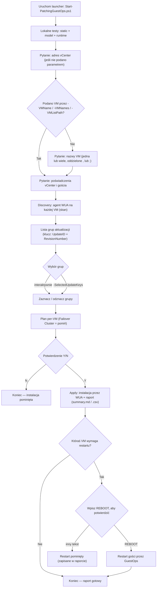
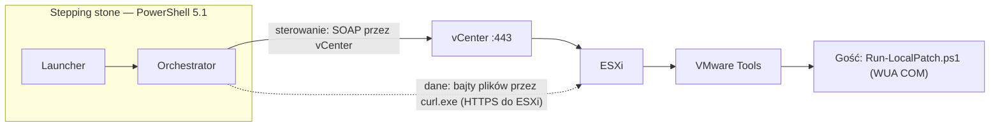

# Patching GuestOps

Automatyzacja instalowania poprawek **Windows Server bez WinRM** — wszystko jedzie kanałem
**vSphere Guest Operations** (przez vCenter i VMware Tools). Pomyślane pod środowisko, gdzie
WinRM/PSRemoting jest twardo zablokowany.

Narzędzie prowadzi administratora przez stały przebieg:

> **discovery → wybór grup aktualizacji → plan per-VM → potwierdzenie → instalacja → (opcjonalny restart)**

Przebieg jest **identyczny dla 1 i dla wielu VM** — jedna maszyna to po prostu lista
jednoelementowa.

---

## Spis treści

- [Wymagania](#wymagania)
- [Szybki start](#szybki-start)
- [Workflow administratora](#workflow-administratora)
- [Najważniejsze parametry](#najważniejsze-parametry)
- [Jak wybierane są aktualizacje](#jak-wybierane-są-aktualizacje)
- [Co powstaje po uruchomieniu](#co-powstaje-po-uruchomieniu)
- [Jak to działa pod spodem](#jak-to-działa-pod-spodem)
- [Struktura repozytorium](#struktura-repozytorium)
- [Testy](#testy)
- [Ograniczenia i bezpieczeństwo](#ograniczenia-i-bezpieczeństwo)

---

## Wymagania

Na maszynie sterującej (stepping stone):

- **Windows PowerShell 5.1** (domyślny w Windows; PS7 nie jest potrzebny).
- Moduł **VMware.PowerCLI** (`Install-Module VMware.PowerCLI`).
- **`curl.exe`** — standardowy składnik Windows (używany do transferu plików; nic nie instalujesz).
- Sieciowy dostęp do **vCenter (:443)** i do hostów **ESXi (:443)**.

Po stronie maszyn docelowych (gości):

- Działające **VMware Tools**.
- Poświadczenia **lokalnego administratora** gościa.
- WinRM **nie jest** wymagany.

Potrzebne poświadczenia (skrypt o nie zapyta, jeśli ich nie podasz):

- do **vCenter**,
- **lokalnego administratora** maszyn docelowych.

---

## Szybki start

```powershell
# Pełny przebieg (zapyta o vCenter / VM / poświadczenia; najpierw odpala lokalne testy):
.\Start-PatchingGuestOps.ps1

# Tylko rozpoznanie (skan WUA), bez pobierania i instalacji:
.\Start-PatchingGuestOps.ps1 -SearchOnly

# Wiele maszyn z pliku, 2 równolegle:
.\Start-PatchingGuestOps.ps1 -VMListPath .\vms.txt -ThrottleLimit 2

# Bez interaktywnego wyboru — wskaż grupy po kluczu UpdateID|RevisionNumber:
.\Start-PatchingGuestOps.ps1 -SelectedUpdateKeys '<UpdateID>|<RevisionNumber>'

# Wznowienie z zapisanego planu:
.\Start-PatchingGuestOps.ps1 -PatchPlanPath .\out\<run>\patch-plan.json
```

Nazwy VM można podać na kilka sposobów: `-VMName <vm>`, `-VMNames vm1,vm2`, albo `-VMListPath
.\vms.txt`. Jeśli nie podasz żadnej, skrypt zapyta interaktywnie i przyjmie **dowolną liczbę
nazw oddzielonych przecinkiem `,` lub średnikiem `;`**.

Format pliku `vms.txt` — jedna nazwa w linii, puste linie i linie zaczynające się od `#` są
pomijane:

```
# produkcja-batch-1
serwer-a
serwer-b
serwer-c
```

Plik możesz trzymać **gdziekolwiek** — liczy się ścieżka podana w `-VMListPath` (względna
do katalogu, z którego uruchamiasz skrypt, albo bezwzględna). Zapis `.\vms.txt` w przykładach
oznacza plik w **bieżącym katalogu** — zwykle katalog repo, obok `Start-PatchingGuestOps.ps1`.

---

## Workflow administratora



Krok po kroku:

1. **Uruchom** `.\Start-PatchingGuestOps.ps1`. Skrypt najpierw odpala lokalne testy (chyba że
   dodasz `-SkipStaticChecks`).
2. **Odpowiedz na pytania o brakujące dane.** Skrypt pyta po kolei: najpierw o adres
   **vCenter**, potem — **tylko jeśli nie podałeś żadnej maszyny** przez `-VMName`, `-VMNames`
   ani `-VMListPath` — **o nazwy VM** (możesz wpisać wiele naraz, oddzielone `,` lub `;`),
   a na końcu o poświadczenia do vCenter i lokalnego admina gości. Cokolwiek przekażesz
   parametrem, o to skrypt nie pyta.
3. **Discovery** — agent skanuje WUA na każdej maszynie i zwraca listę dostępnych aktualizacji
   oraz flagi ról (np. Failover Cluster, SQL).
4. **Wybór grup** — aktualizacje są pogrupowane i identyfikowane technicznie przez
   `UpdateID + RevisionNumber` (KB i tytuł są pokazywane dla człowieka). Wybierasz interaktywnie
   albo z góry przez `-SelectedUpdateKeys`. Domyślnie zaznaczone są aktualizacje krytyczne/ważne
   (patrz [polityka](#jak-wybierane-są-aktualizacje)).
5. **Plan per-VM** — narzędzie pokazuje, co trafi na którą maszynę. **Failover Cluster jest
   twardo pomijany** ("aktualizuj ręcznie, węzeł po węźle"). Plan zapisuje się do
   `patch-plan.json`.
6. **Potwierdzenie** — wpisujesz `Y`, żeby ruszyć z instalacją (chyba że użyjesz
   `-SkipConfirmation`).
7. **Apply** — instalacja przez WUA na gościach; powstaje raport `summary.md` i `summary.csv`.
8. **Restart** — jeśli któraś maszyna zgłosi `rebootRequired`, skrypt pokazuje listę i prosi o
   wpisanie **`REBOOT`** (samo `-SkipConfirmation` tego promptu **nie** pomija). Restart idzie
   przez GuestOps; skrypt go inicjuje, ale **nie czeka** na powrót systemu.

> Maszyn jest wiele i chcesz je robić równolegle? Ustaw `-ThrottleLimit > 1`. To wpływa tylko
> na to, ile VM przetwarza się jednocześnie — sam przebieg, prompty i pliki wynikowe są takie
> same niezależnie od liczby maszyn.

---

## Najważniejsze parametry

| Parametr | Opis |
|----------|------|
| `-VMName <vm>` | Pojedyncza maszyna. |
| `-VMNames vm1,vm2` | Lista maszyn. |
| `-VMListPath .\vms.txt` | Lista maszyn z pliku (jedna na linię, `#` = komentarz). |
| `-SelectedUpdateKeys '<UpdateID>\|<RevisionNumber>'` | Nieinteraktywny wybór grup aktualizacji. |
| `-SearchOnly` | Tylko skan (bez pobierania/instalacji). |
| `-PlanOnly` | Zbuduj plan i zakończ (bez instalacji). |
| `-PatchPlanPath .\out\<run>\patch-plan.json` | Wznów z zapisanego planu. |
| `-ThrottleLimit <n>` | Ile VM przetwarzać równolegle (domyślnie 3). |
| `-SkipConfirmation` | Pomiń pytanie o plan (**nie** pomija promptu o restart). |
| `-SkipStaticChecks` | Pomiń lokalne testy przed uruchomieniem. |
| `-IgnoreVCenterCertificate` | Zignoruj błąd certyfikatu vCenter. |
| `-KeepConnected` | Nie rozłączaj się z vCenter po zakończeniu. |

Pełna lista parametrów znajduje się w nagłówku `Start-PatchingGuestOps.ps1`.

---

## Jak wybierane są aktualizacje

Domyślna polityka najpierw patrzy na pola WUA (`MsrcSeverity`, typ aktualizacji), a gdy ich
brak — na tytuł/kategorię. Z automatu:

- **zaznacza**: aktualizacje krytyczne/ważne oraz cumulative / security / critical / rollup
  i MSRT (Malicious Software Removal Tool),
- **pomija**: sterowniki, aktualizacje *preview*, *feature update* oraz *optional*.

Każdą grupę możesz ręcznie dozaznaczyć lub odznaczyć w kroku wyboru.

---

## Co powstaje po uruchomieniu

Wszystkie pliki wynikowe powstają **na maszynie sterującej** (stepping stone) — **nie** na
serwerach-gościach. Domyślnie trafiają do katalogu **`out\` obok `Start-PatchingGuestOps.ps1`**
(czyli w katalogu repo), w podkatalogu `out\<znacznik-czasu>\`. Katalog `out\` jest
w `.gitignore`. Inną lokalizację ustawisz parametrem `-LocalOutputDirectory`.

Zawartość katalogu przebiegu:

| Plik | Zawartość |
|------|-----------|
| `discovery.json` | Wynik skanu WUA dla wszystkich maszyn. |
| `patch-plan.json` | Plan per-VM (co, gdzie, co pominięte). |
| `apply-results.json` | Wynik instalacji per-VM. |
| `summary.md`, `summary.csv` | Raport końcowy dla człowieka. |
| `reboot-actions.json` | Co zrobiono z restartami (jeśli były wymagane). |
| `NNN-<vm>\status.json`, `agent.log` | Surowe artefakty agenta z każdej maszyny. |

`status.json` i `agent.log` to podstawowe źródło do diagnostyki, jeśli coś pójdzie nie tak na
konkretnej maszynie.

> Na samym gościu narzędzie używa tylko katalogu roboczego `C:\ProgramData\PatchingGuestOps`
> (tam agent zapisuje `status.json` i `agent.log`). Te pliki są automatycznie ściągane na
> maszynę sterującą do `out\<znacznik-czasu>\NNN-<vm>\`, więc raporty zbierasz w jednym
> miejscu — lokalnie.

---

## Jak to działa pod spodem

Kluczowy trik: **sterowanie i dane jadą osobno**, bo .NET Framework w PS 5.1 nie dogada się
z nowoczesnym TLS hosta ESXi.



- **Płaszczyzna sterowania** — PS 5.1 → SOAP → vCenter → ESXi → VMware Tools → gość. Tędy idą
  polecenia (start procesu w gościu, sprawdzenie procesów, uzyskanie URL transferu plików).
- **Płaszczyzna danych** — same bajty plików lecą po HTTPS prosto do ESXi. Tu .NET zawodzi na
  handshake TLS, więc transfer robi **`curl.exe`** (Schannel) — składnik Windows, nie nowa binarka.

Wewnątrz gościa działa **agent** (`guest\Run-LocalPatch.ps1`), który używa wyłącznie WUA COM
(`Microsoft.Update.Session` → searcher → downloader → installer), zapisuje `status.json` oraz
`agent.log` i **nigdy sam nie restartuje** maszyny — zgłasza tylko `pendingReboot`.

---

## Struktura repozytorium

```
Start-PatchingGuestOps.ps1          # Launcher — jedyny punkt wejścia dla administratora
scripts\
  Invoke-GuestOpsPatchValidation.ps1  # Orchestrator: discovery → plan → apply → reboot
  PatchPlanModel.ps1                  # Model offline: logika planowania i raportów (bez I/O)
  GuestOpsLib.ps1                     # Helpery PowerCLI/GuestOps (transfer plików, uruchamianie procesów)
  OrchestratorRuntime.ps1             # Throttling, semantyka apply/reboot, artefakty restartu
  VMTargetLib.ps1                     # Wspólne rozwiązywanie nazw VM (launcher + orchestrator)
guest\
  Run-LocalPatch.ps1                  # Agent działający w gościu (WUA COM)
  UpdateIdentity.ps1                  # Wspólne formatowanie tożsamości aktualizacji
tests\
  Invoke-StaticChecks.ps1             # Bramka statyczna (AST + tekst)
  Invoke-ModelChecks.ps1              # Bramka modelu (zachowanie offline)
  Invoke-RuntimeChecks.ps1            # Bramka runtime (helpery, throttling, resolver)
out\                                  # Artefakty przebiegów (generowane; w .gitignore)
CLAUDE.md                             # Instrukcje dla asystenta / kontekst projektu
```

Warstwy mają jasny podział: launcher tylko pyta o brakujące parametry i odpala orkiestrator;
orkiestrator prowadzi przebieg i pisze artefakty; model i helpery są odseparowane, żeby dało
się je testować offline.

---

## Testy

Brak Pester i kroku budowania — są trzy lekkie bramki offline. **Uruchom je po każdej zmianie
w plikach `.ps1`:**

```powershell
powershell.exe -NoProfile -ExecutionPolicy Bypass -File .\tests\Invoke-StaticChecks.ps1
powershell.exe -NoProfile -ExecutionPolicy Bypass -File .\tests\Invoke-ModelChecks.ps1
powershell.exe -NoProfile -ExecutionPolicy Bypass -File .\tests\Invoke-RuntimeChecks.ps1
```

- **StaticChecks** — pilnuje twardych ograniczeń (zakazane komendy, brak PS7, itd.).
- **ModelChecks** — sprawdza logikę planowania i wyboru aktualizacji.
- **RuntimeChecks** — sprawdza helpery runtime, throttling i rozwiązywanie nazw VM.

Launcher odpala te bramki automatycznie przed każdym przebiegiem (chyba że dodasz
`-SkipStaticChecks`).

---

## Ograniczenia i bezpieczeństwo

- **Bez WinRM / PSRemoting** — celowo. Zakazane są m.in. `Invoke-Command`, `New-PSSession`,
  `Invoke-VMScript`, `Copy-VMGuestFile` (pilnuje tego StaticChecks).
- **Tylko PowerShell 5.1** — żadnego `ForEach-Object -Parallel` (to PS7). Równoległość robią
  zadania (`Start-Job`) sterowane przez `-ThrottleLimit`.
- **Agent nigdy sam nie restartuje** — restart zawsze wymaga świadomego wpisania `REBOOT`
  przez operatora.
- **Failover Cluster = twardy skip** — maszyny klastra trzeba aktualizować ręcznie, węzeł
  po węźle.
- Skrypt **inicjuje** restart, ale **nie czeka** na powrót systemu, VMware Tools ani
  gotowość aplikacji.
