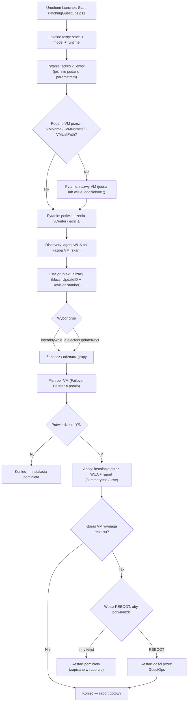
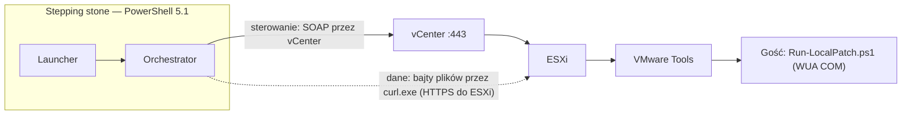

# Patching GuestOps

Automatyzacja instalowania poprawek **Windows Server bez WinRM** — wszystko jedzie kanałem
**vSphere Guest Operations** (przez vCenter i VMware Tools). Pomyślane pod środowisko, gdzie
WinRM/PSRemoting jest twardo zablokowany.

Narzędzie prowadzi administratora przez stały przebieg:

> **discovery → wybór grup aktualizacji → plan per-VM → potwierdzenie → instalacja → (opcjonalny restart)**

Przebieg jest **identyczny dla 1 i dla wielu VM** — jedna maszyna to po prostu lista
jednoelementowa.

---

## Spis treści

- [Wymagania](#wymagania)
- [Szybki start](#szybki-start)
- [Workflow administratora](#workflow-administratora)
- [Najważniejsze parametry](#najważniejsze-parametry)
- [Jak wybierane są aktualizacje](#jak-wybierane-są-aktualizacje)
- [Gdy poświadczenia gościa zostaną odrzucone](#gdy-poświadczenia-gościa-zostaną-odrzucone)
- [Katalogi cyklu na gościach](#katalogi-cyklu-na-gościach)
- [Certyfikaty i transfer plików](#certyfikaty-i-transfer-plików)
- [Co powstaje po uruchomieniu](#co-powstaje-po-uruchomieniu)
- [Jak to działa pod spodem](#jak-to-działa-pod-spodem)
- [Struktura repozytorium](#struktura-repozytorium)
- [Testy](#testy)
- [Ograniczenia i bezpieczeństwo](#ograniczenia-i-bezpieczeństwo)

---

## Wymagania

Na maszynie sterującej (stepping stone):

- **Windows PowerShell 5.1** (domyślny w Windows; PS7 nie jest potrzebny). Launcher GUI wymaga standardowego wątku STA (domyślny w `powershell.exe`).
- Moduł **VMware.PowerCLI** (`Install-Module VMware.PowerCLI`). Faktycznie wymagany jest tylko **VMware.VimAutomation.Core** — tylko on jest importowany i tylko o niego pyta kontrola wymagań, więc lekka instalacja samego tego modułu też wystarczy.
- **`curl.exe`** w `PATH` **maszyny sterującej** — to on przenosi bajty plików do i z ESXi.
  Windows dostarcza go od Windows 10 1803 / Server 2019; na starszych systemach trzeba go
  doinstalować. Skrypt sprawdza jego obecność na starcie i przerywa, jeśli go nie znajdzie.
  Na gościach curl **nie** jest potrzebny.
- Sieciowy dostęp do **vCenter (:443)** i do hostów **ESXi (:443)**.

Po stronie maszyn docelowych (gości):

- Działające **VMware Tools**.
- Konto z prawami **lokalnego administratora** gościa — **lokalne lub domenowe**.
- WinRM **nie jest** wymagany.

Potrzebne poświadczenia (skrypt o nie zapyta, jeśli ich nie podasz):

- do **vCenter**,
- konta z prawami **lokalnego administratora** maszyn docelowych (lokalnego lub domenowego) — przy maszynach domenowych skrypt pyta raz na domenę, a dla lokalnych osobno.

---

## Szybki start

Dostępne są dwa punkty wejścia:
- **`Start-PatchingGuestOpsGui.ps1`** — tryb graficzny (okna dialogowe WinForms do wprowadzenia parametrów, wyboru maszyn, bezpiecznego wprowadzania i zapamiętywania poświadczeń DPAPI oraz wyboru grup poprawek).
- **`Start-PatchingGuestOps.ps1`** — tradycyjny launcher konsolowy do uruchomień w terminalu lub automatyzacji skryptowej.

```powershell
# Uruchomienie przez GUI (okna WinForms, pamięć parametrów i poświadczeń DPAPI):
powershell.exe -NoProfile -ExecutionPolicy Bypass -File .\Start-PatchingGuestOpsGui.ps1

# Pełny przebieg w konsoli (zapyta o vCenter / VM / poświadczenia; najpierw odpala lokalne testy):
.\Start-PatchingGuestOps.ps1

# Tylko rozpoznanie (skan WUA), bez pobierania i instalacji:
.\Start-PatchingGuestOps.ps1 -SearchOnly

# VM rozproszone po kilku vCenter:
.\Start-PatchingGuestOps.ps1 -VIServer 'vc01;vc02;vc03' -VMNames vm1,vm2,vm3

# Wiele maszyn z pliku — discovery i apply obejmują domyślnie wszystkie naraz,
# restart idzie po 2 maszyny na paczkę:
.\Start-PatchingGuestOps.ps1 -VMListPath .\vms.txt -RebootBatchSize 2

# Ograniczenie równoległości apply bez zmiany promienia rażenia restartu:
.\Start-PatchingGuestOps.ps1 -VMListPath .\vms.txt -ThrottleLimit 5 -RebootBatchSize 1

# Bez interaktywnego wyboru — wskaż grupy po kluczu UpdateID|RevisionNumber:
.\Start-PatchingGuestOps.ps1 -SelectedUpdateKeys '<UpdateID>|<RevisionNumber>'

# Wznowienie z zapisanego planu:
.\Start-PatchingGuestOps.ps1 -PatchPlanPath .\out\<run>\patch-plan.json
```

Nazwy VM można podać na kilka sposobów: `-VMName <vm>`, `-VMNames vm1,vm2`, albo `-VMListPath
.\vms.txt`. Jeśli nie podasz żadnej, skrypt zapyta interaktywnie i przyjmie **dowolną liczbę
nazw oddzielonych średnikiem `;`**.

`-VIServer` też może zawierać kilka vCenter oddzielonych średnikiem `;` (np.
`-VIServer 'vc01;vc02'`). Bez `-VIServerCredential` skrypt pyta o poświadczenia vCenter raz
na domenę FQDN i raz dla każdego vCenter bez kropki. Jeśli logowanie do konkretnego vCenter
zostanie odrzucone, skrypt ponowi prompt tylko dla tego vCenter, więc można wtedy podać konto
lokalne. Nie ma osobnego pliku dla vCenter.

Format pliku `vms.txt` — jedna nazwa w linii, puste linie i linie zaczynające się od `#` są
pomijane:

```
# produkcja-batch-1
serwer-a
serwer-b
serwer-c
```

Plik możesz trzymać **gdziekolwiek** — liczy się ścieżka podana w `-VMListPath` (względna
do katalogu, z którego uruchamiasz skrypt, albo bezwzględna). Zapis `.\vms.txt` w przykładach
oznacza plik w **bieżącym katalogu** — zwykle katalog repo, obok `Start-PatchingGuestOps.ps1`.

Wpisy listy to **FQDN-y** (np. `vm1.contoso.com`). Sufiks po pierwszej kropce wyznacza domenę — skrypt pyta o poświadczenia gościa **raz na domenę** (grupując maszyny po sufiksie). Wpis bez kropki (np. `oldbox`) to maszyna **lokalna** — pytana osobno, jedna na maszynę. Nazwę w vCenter skrypt rozwiązuje najpierw po pełnym FQDN. Gdy takiego wpisu nie ma, dopuszcza krótką nazwę (część przed pierwszą kropką) tylko wtedy, gdy VMware Tools potwierdza żądany FQDN gościa. Brak tej informacji, niezgodność domeny lub niejednoznaczna nazwa blokują operację. Kontrola obowiązuje przy skanowaniu, instalacji i restarcie. Parametr `-GuestCredential` wymusza jedno poświadczenie dla **wszystkich** VM (tryb nieinteraktywny / pojedyncza domena).

---

## Workflow administratora


```mermaid
flowchart TD
    A["Uruchom launcher: Start-PatchingGuestOps.ps1"] --> C["Lokalne testy: static + model + runtime"]
    C --> V["Pytanie: adres vCenter (jeśli nie podano parametrem)"]
    V --> Q{"Podano VM przez -VMName / -VMNames / -VMListPath?"}
    Q -->|"Tak"| CR["Pytanie: poświadczenia vCenter i gościa"]
    Q -->|"Nie"| ASK["Pytanie: nazwy VM (jedna lub wiele, oddzielone ;)"]
    ASK --> CR
    CR --> D["Discovery: agent WUA na każdej VM (skan)"]
    D --> E["Lista grup aktualizacji (klucz: UpdateID + RevisionNumber)"]
    E --> F{"Wybór grup"}
    F -->|"interaktywnie"| G["Zaznacz / odznacz grupy"]
    F -->|"-SelectedUpdateKeys"| G
    G --> H["Plan per-VM (Failover Cluster = pomiń)"]
    H --> I{"Potwierdzenie Y/N"}
    I -->|"N"| Z["Koniec — instalacja pominięta"]
    I -->|"Y"| J["Apply: instalacja przez WUA + raport (summary.md / .csv)"]
    J --> K{"Któraś VM wymaga restartu?"}
    K -->|"Nie"| ZZ["Koniec — raport gotowy"]
    K -->|"Tak"| L{"Wpisz REBOOT, aby potwierdzić"}
    L -->|"inny tekst"| ZR["Restart pominięty (zapisane w raporcie)"]
    L -->|"REBOOT"| M["Restart gości przez GuestOps"]
    M --> ZZ
```

Krok po kroku:

1. **Uruchom** `.\Start-PatchingGuestOps.ps1`. Skrypt najpierw odpala lokalne testy (chyba że
   dodasz `-SkipStaticChecks`).
2. **Odpowiedz na pytania o brakujące dane.** Skrypt pyta po kolei: najpierw o adres
   **vCenter** (jedno lub wiele, oddzielone `;`), potem — **tylko jeśli nie podałeś żadnej maszyny** przez `-VMName`, `-VMNames`
   ani `-VMListPath` — **o nazwy VM** (możesz wpisać wiele naraz, oddzielone `;`),
   a na końcu o poświadczenia do vCenter oraz gości — dla obu warstw **jedno okno na domenę**
   (wg sufiksu FQDN) i **jedno na każdą nazwę lokalną**. Jeśli credentiale vCenter zostaną
   odrzucone, skrypt ponowi prompt dla tego konkretnego vCenter. Cokolwiek przekażesz
   parametrem, o to skrypt nie pyta.
3. **Discovery** — agent skanuje WUA na każdej maszynie i zwraca listę dostępnych aktualizacji
   oraz flagi ról (np. Failover Cluster, Domain Controller, SQL, Exchange, IIS).
4. **Wybór grup** — aktualizacje są pogrupowane i identyfikowane technicznie przez
   `UpdateID + RevisionNumber` (KB i tytuł są pokazywane dla człowieka). Wybierasz interaktywnie
   albo z góry przez `-SelectedUpdateKeys`. Domyślnie zaznaczone są aktualizacje krytyczne/ważne
   (patrz [polityka](#jak-wybierane-są-aktualizacje)).
5. **Plan per-VM** — narzędzie pokazuje, co trafi na którą maszynę. **Failover Cluster jest
   twardo pomijany** ("aktualizuj ręcznie, węzeł po węźle"). Plan zapisuje się do
   `patch-plan.json`.
6. **Potwierdzenie** — wpisujesz `Y`, żeby ruszyć z instalacją (chyba że użyjesz
   `-SkipConfirmation`).
7. **Apply** — instalacja przez WUA na gościach; powstaje raport `summary.md` i `summary.csv`.
8. **Restart** — jeśli któraś maszyna zgłosi `rebootRequired` po apply albo już w discovery miała
   `pendingRebootBefore.isPending=true`, skrypt pokazuje listę i prosi o wpisanie **`REBOOT`**
   (samo `-SkipConfirmation` tego promptu **nie** pomija). Restart idzie przez GuestOps.
   Cele są dzielone na stałe paczki po `-RebootBatchSize` (gdy go nie podasz, skrypt zapyta
   o rozmiar zaraz po `REBOOT`; Enter oznacza 1); kolejna paczka startuje dopiero po
   potwierdzeniu, że każda VM z poprzedniej paczki **z odczytaną wartością bazową** zgłosiła
   `LastBootUpTime` bezwzględnie nowszy od tej wartości — chyba że operator świadomie wymusił
   przejście przez `CONTINUE`.

   Czas oczekiwania jednej paczki określa `-RebootTimeoutMinutes` (domyślnie 30), a częstotliwość
   odpytywania — `-PollSeconds`. Pierwszy odczyt po wysłaniu restartu jest odkładany o ok. 90
   sekund, bo wcześniej maszyna i tak nie może zgłosić nowszego czasu startu. Odczyty idą
   sekwencyjnie z procesu narzędzia, bez osobnych zadań i bez dodatkowych sesji vCenter.
   Po timeoucie operator wybiera `RETRY` (bez ponownego restartu),
   `CONTINUE` (wymuszone, niezweryfikowane przejście) albo `ABORT`. Te decyzje są wymagane także
   przy braku wartości bazowej lub błędzie inicjacji; błąd wysłania restartu nie jest automatycznie
   ponawiany. `CONTINUE` i `ABORT` pozostawiają ślad w raporcie i kończą przebieg kodem 1.

> `-RebootBatchSize` określa równoległość wewnątrz jednej paczki rebootu i nie pozwala rozpocząć
> następnej przed przejściem bramki boot time. `-ThrottleLimit` to osobna gałka — steruje wyłącznie
> tym, ile VM przechodzi jednocześnie przez discovery i apply.

9. **Kolejna runda** — po potwierdzonym restarcie przebieg wraca do discovery i sprawdza, czy
   maszyny są już aktualne. „Zielona" znaczy: nie została żadna grupa, którą polityka domyślna by
   wybrała (sterowniki, preview i optional nie blokują), pomniejszona o grupy, które sam odznaczyłeś.
   Jeśli coś zostało, skrypt pyta `CONTINUE`/`FINISH` i przy `CONTINUE` patchuje te maszyny
   ponownie. Limit rund to `-MaxPatchRounds` (domyślnie 3 rundy instalacji plus końcowe discovery
   weryfikacyjne). Artefakty każdej rundy trafiają do `out\<run>\round-NN\`, a `out\<run>\summary.md`
   zbiera stan końcowy. Kolejna runda **nie** startuje, jeśli którakolwiek restartowana maszyna nie
   potwierdziła nowszego czasu startu.

> Przebieg nieinteraktywny: `-SkipConfirmation` sprawia, że po rundzie 1 skrypt kończy pracę
> zamiast pytać `CONTINUE`/`FINISH`. To samo dzieje się przy `-SelectedUpdateKeys`, bo wskazane
> klucze zawierają `RevisionNumber`, którego nie ma w grupach kolejnej rundy. W obu wypadkach
> przebieg kończy się kodem 1, jeśli zostały niezainstalowane aktualizacje.

---

## Najważniejsze parametry

| Parametr | Opis |
|----------|------|
| `-VIServer 'vc01;vc02'` | Jedno lub wiele vCenter, oddzielone średnikiem; poświadczenia grupowane po domenie. |
| `-VMName <vm>` | Pojedyncza maszyna. |
| `-VMNames vm1,vm2` | Lista maszyn. |
| `-VMListPath .\vms.txt` | Lista maszyn z pliku (jedna na linię, `#` = komentarz). |
| `-SelectedUpdateKeys '<UpdateID>\|<RevisionNumber>'` | Nieinteraktywny wybór grup aktualizacji. |
| `-SearchOnly` | Tylko skan (bez pobierania/instalacji). |
| `-PlanOnly` | Zbuduj plan i zakończ (bez instalacji). Sam pyta o wybór grup jak zwykły przebieg; razem z `-SearchOnly` niczego nie wybiera. |
| `-PatchPlanPath .\out\<run>\patch-plan.json` | Wznów z zapisanego planu. |
| `-ThrottleLimit <n>` | Ile VM przechodzi jednocześnie przez discovery i apply (domyślnie: wszystkie z listy celów). |
| `-RebootBatchSize <n>` | Ile VM restartuje się w jednej paczce (gdy pominiesz — skrypt zapyta, Enter = 1). |
| `-MaxPatchRounds <n>` | Limit rund instalacji (domyślnie 3). |
| `-RebootTimeoutMinutes <n>` | Maksymalny czas potwierdzania każdej paczki rebootu (domyślnie 30 minut). |
| `-PollSeconds <n>` | Odstęp odpytywania procesów gościa w fazach discovery i apply oraz odczytów boot time podczas oczekiwania na reboot (domyślnie 15). |
| `-SkipConfirmation` | Pomiń pytanie o plan i zakończ po rundzie 1 zamiast pytać `CONTINUE`/`FINISH` (**nie** pomija promptu o restart ani o rozmiar paczki). |
| `-SkipStaticChecks` | Pomiń lokalne testy przed uruchomieniem. |
| `-IgnoreVCenterCertificate` | Zignoruj błąd certyfikatu vCenter. |
| `-KeepConnected` | Nie rozłączaj się z vCenter po zakończeniu. |

`-SearchOnly` nie można łączyć z `-PatchPlanPath`. Do sprawdzenia zapisanego planu bez instalacji służy `-PlanOnly -PatchPlanPath <plik>`.

Pełna lista parametrów znajduje się w nagłówku `Start-PatchingGuestOps.ps1`.

---

## Jak wybierane są aktualizacje

Domyślna polityka najpierw patrzy na pola WUA (`MsrcSeverity`, typ aktualizacji), a gdy ich
brak — na tytuł/kategorię. Z automatu:

- **zaznacza**: aktualizacje krytyczne/ważne oraz cumulative / security / critical / rollup
  i MSRT (Malicious Software Removal Tool),
- **pomija**: sterowniki, aktualizacje *preview*, *feature update* oraz *optional*.

Każdą grupę możesz ręcznie dozaznaczyć lub odznaczyć w kroku wyboru.

---

## Gdy poświadczenia gościa zostaną odrzucone

Gdy gość odrzuci hasło w trakcie przebiegu, narzędzie nie przerywa całej pracy i nie ponawia
w kółko tego samego hasła. Pyta o decyzję dla **konta**, nie dla pojedynczej maszyny.

Konta są grupowane tak samo, jak przy pytaniu o hasła na starcie: jedno konto na sufiks domeny
(wszystko po pierwszej kropce w FQDN) i osobne konto dla każdej maszyny bez kropki w nazwie.
Dlatego dwie maszyny robocze z własnymi lokalnymi kontami `Administrator` to **dwa różne konta**.

### Przykład: VM01 i VM02 z osobnymi lokalnymi kontami

Lista celów to `VM01` i `VM02` — obie bez domeny, obie z lokalnym `Administrator`, ale z różnymi
hasłami. Skrypt pyta o hasło osobno dla `VM01` i osobno dla `VM02`.

Załóżmy, że hasło do `VM01` jest nieaktualne. W trakcie przebiegu:

```
Guest credentials for VM01 were rejected: The guest rejected the supplied credential.
Account local:VM01 applies to: VM01
Actions:
  - RETRY  provide replacement guest credentials and validate them before retrying.
  - SKIP   skip this account for the rest of this run.
  - ABORT  do not start further guest operations.
Choose RETRY, SKIP, or ABORT (Enter aborts):
```

- **RETRY** — podajesz nowe dane. Zanim cokolwiek zostanie ponowione, narzędzie **sprawdza je na
  tej maszynie** (`ValidateCredentialsInGuest`). Dopiero zweryfikowane dane wchodzą do użycia
  w tym i kolejnych etapach: discovery, apply, odczyt czasu rozruchu, inicjacja restartu.
  Ponowne podanie tego samego hasła nie doprowadzi do ponowienia operacji — przy pierwszym
  pytaniu trafi jeszcze raz do walidacji na gościu i tam zostanie odrzucone, przy kolejnym jest
  odrzucane od razu, bez sięgania do gościa.
- **SKIP** — `VM01` wypada z tego przebiegu. **`VM02` pracuje dalej normalnie**, bo to inne konto.
  Pominięta maszyna nie jest łatana, nie jest restartowana i nie wchodzi do kolejnej rundy.
- **ABORT** (także samo Enter) — nie rozpoczynają się kolejne operacje na gościach.

Pusty Enter to **przerwanie**, nie zgoda na ponowienie — wciśnięcie Enter „na odczepnego" nigdy
nie spowoduje próby z tym samym hasłem.

### Kod wyjścia

Pominięcie konta to jawna porażka, nie cichy sukces. `VM01` kończy przebieg w stanie `Failed`
z podanym powodem, trafia do `summary.md`, a **cały przebieg kończy się kodem 1** — nawet jeśli
`VM02` została załatana bez zarzutu. Kod 0 wymaga, żeby każda maszyna skończyła jako
`Green`/`GreenByOperatorChoice`/`Excluded`.

### Zapamiętywanie poprawionych danych (GUI)

W trybie GUI okno z nowymi danymi ma **domyślnie zaznaczone** „Remember on this machine" — tak
samo jak przy pytaniu o hasła na starcie. Po udanej walidacji poprawione hasło trafia do
`credentials.json` pod klucz tego konta, więc następnym razem nie trzeba go wpisywać ponownie.

Odznaczenie „Remember" oznacza, że dane posłużą **tylko temu przebiegowi** — plik zostaje z tym,
co już w nim było, a jawna odmowa ma pierwszeństwo do końca przebiegu (kolejna maszyna z tego
samego konta nie zapisze go „przy okazji"). Hasła, które już były zapisane, nigdy nie są kasowane,
a poprawka jednego vCenter zapisuje się pod kluczem tego jednego serwera, nie pod wspólnym kluczem
domeny.

### Uruchomienie bez interakcji

`-SkipConfirmation` oznacza, że nie ma komu odpowiedzieć na pytanie, więc **żadne pytanie o nowe
hasło się nie pojawi**. Odrzucone poświadczenia kończą się jawną porażką tej maszyny i kodem 1 —
przebieg nie zawiesza się na promptcie i nie zgaduje.

---

## Katalogi cyklu na gościach

Każdy cykl agenta pracuje we własnym podkatalogu `C:\ProgramData\PatchingGuestOps\<runId>`.
Narzędzie kasuje ten katalog **tylko wtedy**, gdy potrafi udowodnić, że cykl się zakończył:
terminalny status agenta, wynik procesu mówiący „zakończony", oba artefakty pobrane **w tej**
kolekcji i oba pliki obecne na maszynie sterującej. W przeciwnym razie katalog zostaje, a powód
trafia do logu i do rekordu maszyny (`cleanupStatus`, `cleanupReason`).

**Część katalogów zostanie na stałe — i tak ma być.** vSphere pamięta zakończony proces tylko
przez krótką chwilę. Gość, który skończy pracę zanim pętla odpytywania do niego wróci, wypada
z listy procesów, więc narzędzie nie ma dowodu zakończenia procesu i katalog zachowuje. Przy
większych flotach to sytuacja zwyczajna, nie awaria.

Nie ma automatycznego sprzątacza po wieku plików i **nie będzie** — katalog, którego to narzędzie
nie potrafi uznać za zakończony, jest dokładnie tym, którego nie wolno mu ruszyć. Przy dużych,
regularnie łatanych flotach warto co jakiś czas przejrzeć `C:\ProgramData\PatchingGuestOps`
i usunąć stare katalogi poza przebiegiem narzędzia.

---

## Certyfikaty i transfer plików

Narzędzie rozmawia z dwoma różnymi punktami końcowymi i **każdy ma osobne wymagania wobec
certyfikatów**:

| Kanał | Czym idzie | Czego wymaga |
|---|---|---|
| Sterowanie (SOAP) | PowerCLI / .NET → **vCenter:443** | zaufanie do certyfikatu vCenter **albo** `-IgnoreVCenterCertificate` |
| Dane (bajty plików) | **`curl.exe`** → **ESXi:443** | zaufanie do certyfikatu ESXi — **zawsze**, bez wyjątku |

**`-IgnoreVCenterCertificate` dotyczy wyłącznie sesji PowerCLI do vCenter.** Ustawia
`Set-PowerCLIConfiguration -InvalidCertificateAction Ignore` i nie ma żadnego wpływu na curl —
to osobny proces z własnym magazynem zaufania (Schannel, czyli magazyn certyfikatów Windows).
Transfery nie są uruchamiane z `--insecure`, więc **niezaufany certyfikat ESXi zatrzyma transfer
plików, nawet jeśli połączenie z vCenter przeszło**.

**Nazwa też musi się zgadzać.** vSphere zwraca adres transferu z gwiazdką (`https://*/...`),
a narzędzie podstawia w jej miejsce **nazwę hosta ESXi z inwentarza vCenter**. Certyfikat ESXi
musi być ważny dokładnie dla tej nazwy. Jeśli vCenter ma host wpisany po adresie IP albo po
nazwie krótkiej, a certyfikat wystawiono na FQDN — curl odrzuci połączenie, mimo że sam
certyfikat jest zaufany.

W praktyce: zaimportuj na maszynie sterującej certyfikat CA, który podpisał certyfikaty ESXi,
i upewnij się, że hosty figurują w vCenter pod nazwami zgodnymi z tymi certyfikatami.

---

## Co powstaje po uruchomieniu

Wszystkie pliki wynikowe powstają **na maszynie sterującej** (stepping stone) — **nie** na
serwerach-gościach. Domyślnie trafiają do katalogu **`out\` obok `Start-PatchingGuestOps.ps1`**
(czyli w katalogu repo), w podkatalogu `out\<znacznik-czasu>\`. Katalog `out\` jest
w `.gitignore`. Inną lokalizację ustawisz parametrem `-LocalOutputDirectory`.

Zawartość katalogu przebiegu:

| Plik | Zawartość |
|------|-----------|
| `discovery.json` | Wynik skanu WUA dla wszystkich maszyn. |
| `patch-plan.json` | Plan per-VM (co, gdzie, co pominięte). |
| `apply-results.json` | Wynik instalacji per-VM. |
| `summary.md`, `summary.csv` | Raport końcowy dla człowieka. |
| `reboot-actions.json` | Wynik restartów: paczka, baseline/observed boot time i uptime, status walidacji, decyzja operatora i błędy. |
| `NNN-<vm>\status.json`, `agent.log` | Surowe artefakty agenta z każdej maszyny. |

`status.json` i `agent.log` to podstawowe źródło do diagnostyki, jeśli coś pójdzie nie tak na
konkretnej maszynie.

> Na samym gościu każdy cykl używa osobnego podkatalogu `C:\ProgramData\PatchingGuestOps\<runId>`
> (tam agent zapisuje `status.json` i `agent.log`). Identyfikator w wyniku musi pasować do bieżącego cyklu; stary wynik jest odrzucany. Te pliki są automatycznie ściągane na
> maszynę sterującą do `out\<znacznik-czasu>\NNN-<vm>\`, więc raporty zbierasz w jednym
> miejscu — lokalnie.

### Magazyn ustawień i poświadczeń GUI (opcjonalny)

Gdy korzystasz z launchera GUI (`Start-PatchingGuestOpsGui.ps1`), w profilu użytkownika maszyny sterującej wykorzystywany jest katalog:
`%LOCALAPPDATA%\PatchingGuestOps\`

- **`settings.json`** — zapamiętane domyślne parametry formularza (ostatnio używane vCenter, limity, katalog wyjściowy, flagi). Lista maszyn VM celowo **nie** jest w nim zapisywana.
- **`credentials.json`** — zaszyfrowane poświadczenia vCenter i gości (szyfrowanie DPAPI per-klucz, powiązane z kontem zalogowanego użytkownika Windows). Poświadczenia trafiają tu tylko wtedy, gdy w oknie dialogowym zaznaczysz *Remember on this machine*.

---

## Jak to działa pod spodem

Kluczowy trik: **sterowanie i dane jadą osobno**, bo .NET Framework w PS 5.1 nie dogada się
z nowoczesnym TLS hosta ESXi.


```mermaid
flowchart LR
    subgraph SS["Stepping stone — PowerShell 5.1"]
      L["Launcher"] --> O["Orchestrator"]
    end
    O -->|"sterowanie: SOAP przez vCenter"| VC["vCenter :443"]
    VC --> ESXi["ESXi"]
    ESXi --> T["VMware Tools"]
    T --> G["Gość: Run-LocalPatch.ps1 (WUA COM)"]
    O -.->|"dane: bajty plików przez curl.exe (HTTPS do ESXi)"| ESXi
```

- **Płaszczyzna sterowania** — PS 5.1 → SOAP → vCenter → ESXi → VMware Tools → gość. Tędy idą
  polecenia (start procesu w gościu, sprawdzenie procesów, uzyskanie URL transferu plików).
- **Płaszczyzna danych** — same bajty plików lecą po HTTPS prosto do ESXi. Tu .NET zawodzi na
  handshake TLS, więc transfer robi **`curl.exe`** (Schannel) — składnik Windows, nie nowa binarka.

Wewnątrz gościa działa **agent** (`guest\Run-LocalPatch.ps1`), który używa wyłącznie WUA COM
(`Microsoft.Update.Session` → searcher → downloader → installer), zapisuje `status.json` oraz
`agent.log` i **nigdy sam nie restartuje** maszyny — zgłasza tylko `pendingReboot`.

---

## Struktura repozytorium

```
Start-PatchingGuestOps.ps1          # Launcher konsolowy — główny punkt wejścia CLI
Start-PatchingGuestOpsGui.ps1       # Launcher GUI — okna dialogowe WinForms i magazyn ustawień
scripts\
  Invoke-GuestOpsPatchValidation.ps1  # Orchestrator: discovery → plan → apply → reboot
  PatchPlanModel.ps1                  # Model offline: logika planowania i raportów (bez I/O)
  GuestOpsLib.ps1                     # Helpery PowerCLI/GuestOps (transfer plików, uruchamianie procesów)
  OrchestratorRuntime.ps1             # Throttling, semantyka apply/reboot, artefakty restartu
  VMTargetLib.ps1                     # Wspólne rozwiązywanie nazw VM (launcher + orchestrator)
  GuiPrompts.ps1                      # Okna dialogowe WinForms (parametry, poświadczenia, grupy)
  SettingsStore.ps1                   # Zarządzanie ustawieniami i magazynem poświadczeń DPAPI
guest\
  Run-LocalPatch.ps1                  # Agent działający w gościu (WUA COM)
  Read-BootTime.ps1                   # Odczyt Win32_OperatingSystem.LastBootUpTime w gościu
  UpdateIdentity.ps1                  # Wspólne formatowanie tożsamości aktualizacji
tests\
  Invoke-StaticChecks.ps1             # Bramka statyczna (AST + tekst)
  Invoke-ModelChecks.ps1              # Bramka modelu (zachowanie offline)
  Invoke-RuntimeChecks.ps1            # Bramka runtime (helpery, throttling, resolver)
  Invoke-RegressionChecks.ps1         # Regresje instalacji, restartów i stanów; wywoływane przez RuntimeChecks
  Invoke-GuestOpsHarnessChecks.ps1    # Bramka harness (cykl agenta w symulowanym vSphere)
out\                                  # Artefakty przebiegów (generowane; w .gitignore)
CLAUDE.md                             # Instrukcje dla asystenta / kontekst projektu
```

Warstwy mają jasny podział: launcher tylko pyta o brakujące parametry i odpala orkiestrator;
orkiestrator prowadzi przebieg i pisze artefakty; model i helpery są odseparowane, żeby dało
się je testować offline.

---

## Testy

Brak Pester i kroku budowania — są cztery lekkie bramki. **Uruchom je po każdej zmianie
w plikach `.ps1`:**

```powershell
powershell.exe -NoProfile -ExecutionPolicy Bypass -File .\tests\Invoke-StaticChecks.ps1
powershell.exe -NoProfile -ExecutionPolicy Bypass -File .\tests\Invoke-ModelChecks.ps1
powershell.exe -NoProfile -ExecutionPolicy Bypass -File .\tests\Invoke-RuntimeChecks.ps1
powershell.exe -NoProfile -ExecutionPolicy Bypass -File .\tests\Invoke-GuestOpsHarnessChecks.ps1
```

- **StaticChecks** — pilnuje twardych ograniczeń (zakazane komendy, brak PS7, itd.).
- **ModelChecks** — sprawdza logikę planowania i wyboru aktualizacji.
- **RuntimeChecks** — sprawdza helpery runtime, throttling i rozwiązywanie nazw VM.
- **GuestOpsHarnessChecks** — przepuszcza prawdziwy cykl agenta przez podstawiony vSphere.
  Wymaga zainstalowanego PowerCLI (tylko dla typów .NET — bez vCenter i bez maszyn); gdy go
  nie ma, sama się pomija i kończy kodem 0.

Launcher odpala te bramki automatycznie przed każdym przebiegiem (chyba że dodasz
`-SkipStaticChecks`).

---

## Ograniczenia i bezpieczeństwo

- **Bez WinRM / PSRemoting** — celowo. Zakazane są m.in. `Invoke-Command`, `New-PSSession`,
  `Invoke-VMScript`, `Copy-VMGuestFile` (pilnuje tego StaticChecks).
- **Tylko PowerShell 5.1** — żadnego `ForEach-Object -Parallel` (to PS7). Discovery i apply
  startują agenta na wszystkich gościach po kolei i odpytują ich z jednej pętli w procesie
  narzędzia, w jednej sesji vCenter; `Start-Job` został już tylko przy inicjacji restartu.
- **Agent nigdy sam nie restartuje** — restart zawsze wymaga świadomego wpisania `REBOOT`
  przez operatora.
- **Failover Cluster = twardy skip** — maszyny klastra trzeba aktualizować ręcznie, węzeł
  po węźle.
- Reboot jest potwierdzany przez zmianę `Win32_OperatingSystem.LastBootUpTime` oraz ponowną
  dostępność GuestOps/VMware Tools; nie oznacza to gotowości aplikacji.
- `CONTINUE` po timeoutem lub przy braku baseline jest świadomym obejściem i zawsze powoduje
  końcowy kod wyjścia 1. Szczegóły i statusy (`Confirmed`, `Unverified`, `Timeout`,
  `InitiationError`, `NotStartedAfterAbort`) są zapisywane w `reboot-actions.json` i `summary.md`.
