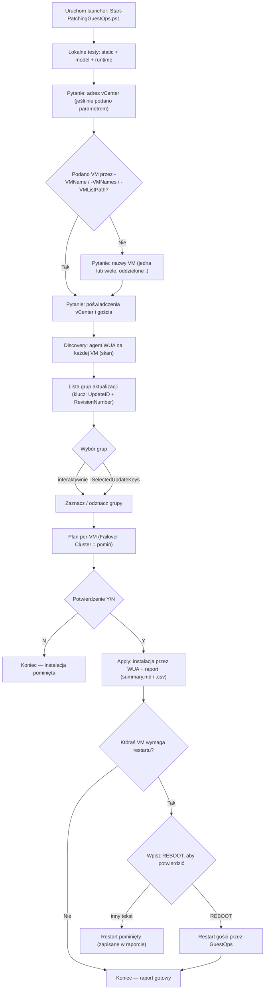
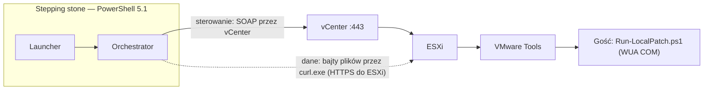

# Patching GuestOps

Automatyzacja instalowania poprawek **Windows Server bez WinRM** — wszystko jedzie kanałem
**vSphere Guest Operations** (przez vCenter i VMware Tools). Pomyślane pod środowisko, gdzie
WinRM/PSRemoting jest twardo zablokowany.

Narzędzie prowadzi administratora przez stały przebieg:

> **discovery → wybór grup aktualizacji → plan per-VM → potwierdzenie → instalacja → (opcjonalny restart)**

Przebieg jest **identyczny dla 1 i dla wielu VM** — jedna maszyna to po prostu lista
jednoelementowa.

---

## Spis treści

- [Wymagania](#wymagania)
- [Szybki start](#szybki-start)
- [Workflow administratora](#workflow-administratora)
- [Najważniejsze parametry](#najważniejsze-parametry)
- [Jak wybierane są aktualizacje](#jak-wybierane-są-aktualizacje)
- [Gdy poświadczenia gościa zostaną odrzucone](#gdy-poświadczenia-gościa-zostaną-odrzucone)
- [Katalogi cyklu na gościach](#katalogi-cyklu-na-gościach)
- [Certyfikaty i transfer plików](#certyfikaty-i-transfer-plików)
- [Co powstaje po uruchomieniu](#co-powstaje-po-uruchomieniu)
- [Jak to działa pod spodem](#jak-to-działa-pod-spodem)
- [Struktura repozytorium](#struktura-repozytorium)
- [Testy](#testy)
- [Co zrobić, gdy…](#co-zrobić-gdy)
- [Ograniczenia i bezpieczeństwo](#ograniczenia-i-bezpieczeństwo)

---

## Wymagania

Na maszynie sterującej (stepping stone):

- **Windows PowerShell 5.1** (domyślny w Windows; PS7 nie jest potrzebny). Launcher GUI wymaga standardowego wątku STA (domyślny w `powershell.exe`).
- Moduł **VMware.PowerCLI** (`Install-Module VMware.PowerCLI`). Faktycznie wymagany jest tylko **VMware.VimAutomation.Core** — tylko on jest importowany i tylko o niego pyta kontrola wymagań, więc lekka instalacja samego tego modułu też wystarczy.
- **`curl.exe`** w `PATH` **maszyny sterującej** — to on przenosi bajty plików do i z ESXi.
  Windows dostarcza go od Windows 10 1803 / Server 2019; na starszych systemach trzeba go
  doinstalować. Skrypt sprawdza jego obecność na starcie i przerywa, jeśli go nie znajdzie.
  Na gościach curl **nie** jest potrzebny.
- Sieciowy dostęp do **vCenter (:443)** i do hostów **ESXi (:443)**.

Po stronie maszyn docelowych (gości):

- Działające **VMware Tools**.
- Konto z prawami **lokalnego administratora** gościa — **lokalne lub domenowe**.
- WinRM **nie jest** wymagany.

Potrzebne poświadczenia (skrypt o nie zapyta, jeśli ich nie podasz):

- do **vCenter**,
- konta z prawami **lokalnego administratora** maszyn docelowych (lokalnego lub domenowego) — przy maszynach domenowych skrypt pyta raz na domenę, a dla lokalnych osobno.

---

## Szybki start

Dostępne są dwa punkty wejścia:
- **`Start-PatchingGuestOpsGui.ps1`** — tryb graficzny (okna dialogowe WinForms do wprowadzenia parametrów, wyboru maszyn, bezpiecznego wprowadzania i zapamiętywania poświadczeń DPAPI, wyboru grup poprawek oraz pytania o świeży reskan).
- **`Start-PatchingGuestOps.ps1`** — tradycyjny launcher konsolowy do uruchomień w terminalu lub automatyzacji skryptowej.

```powershell
# Uruchomienie przez GUI (okna WinForms, pamięć parametrów i poświadczeń DPAPI):
powershell.exe -NoProfile -ExecutionPolicy Bypass -File .\Start-PatchingGuestOpsGui.ps1

# Pełny przebieg w konsoli (zapyta o vCenter / VM / poświadczenia; najpierw odpala lokalne testy):
.\Start-PatchingGuestOps.ps1

# Tylko rozpoznanie (skan WUA), bez pobierania i instalacji:
.\Start-PatchingGuestOps.ps1 -SearchOnly

# VM rozproszone po kilku vCenter:
.\Start-PatchingGuestOps.ps1 -VIServer 'vc01;vc02;vc03' -VMNames vm1,vm2,vm3

# Wiele maszyn z pliku — discovery i apply obejmują domyślnie wszystkie naraz,
# restart idzie po 2 maszyny na paczkę:
.\Start-PatchingGuestOps.ps1 -VMListPath .\vms.txt -RebootBatchSize 2

# Ograniczenie równoległości apply bez zmiany promienia rażenia restartu:
.\Start-PatchingGuestOps.ps1 -VMListPath .\vms.txt -ThrottleLimit 5 -RebootBatchSize 1

# Bez interaktywnego wyboru — wskaż grupy po kluczu UpdateID|RevisionNumber:
.\Start-PatchingGuestOps.ps1 -SelectedUpdateKeys '<UpdateID>|<RevisionNumber>'

# Wznowienie z zapisanego planu:
.\Start-PatchingGuestOps.ps1 -PatchPlanPath .\out\<run>\patch-plan.json
```

Nazwy VM można podać na kilka sposobów: `-VMName <vm>`, `-VMNames vm1,vm2`, albo `-VMListPath
.\vms.txt`. Jeśli nie podasz żadnej, skrypt zapyta interaktywnie i przyjmie **dowolną liczbę
nazw oddzielonych średnikiem `;`**.

`-VIServer` też może zawierać kilka vCenter oddzielonych średnikiem `;` (np.
`-VIServer 'vc01;vc02'`). Bez `-VIServerCredential` skrypt pyta o poświadczenia vCenter raz
na domenę FQDN i raz dla każdego vCenter bez kropki. Jeśli logowanie do konkretnego vCenter
zostanie odrzucone, skrypt ponowi prompt tylko dla tego vCenter, więc można wtedy podać konto
lokalne. Nie ma osobnego pliku dla vCenter.

Format pliku `vms.txt` — jedna nazwa w linii, puste linie i linie zaczynające się od `#` są
pomijane:

```
# produkcja-batch-1
serwer-a
serwer-b
serwer-c
```

Plik możesz trzymać **gdziekolwiek** — liczy się ścieżka podana w `-VMListPath` (względna
do katalogu, z którego uruchamiasz skrypt, albo bezwzględna). Zapis `.\vms.txt` w przykładach
oznacza plik w **bieżącym katalogu** — zwykle katalog repo, obok `Start-PatchingGuestOps.ps1`.

Wpisy listy to **FQDN-y** (np. `vm1.contoso.com`). Sufiks po pierwszej kropce wyznacza domenę — skrypt pyta o poświadczenia gościa **raz na domenę** (grupując maszyny po sufiksie). Wpis bez kropki (np. `oldbox`) to maszyna **lokalna** — pytana osobno, jedna na maszynę. Nazwę w vCenter skrypt rozwiązuje najpierw po pełnym FQDN. Gdy takiego wpisu nie ma, dopuszcza krótką nazwę (część przed pierwszą kropką) tylko wtedy, gdy VMware Tools potwierdza żądany FQDN gościa. Brak tej informacji, niezgodność domeny lub niejednoznaczna nazwa blokują operację. Kontrola obowiązuje przy skanowaniu, instalacji i restarcie. Parametr `-GuestCredential` wymusza jedno poświadczenie dla **wszystkich** VM (tryb nieinteraktywny / pojedyncza domena).

**Zakres inwentarza.** Każde wyszukanie maszyny jest ograniczone do połączeń vCenter tego
przebiegu (`-VIServer`). Bez takiego ograniczenia PowerCLI odpowiada z globalnych sesji
domyślnych, więc maszyna istniejąca w vCenter, którego operator nie wskazał, mogłaby zostać
przeskanowana, załatana i zrestartowana. Pusty zakres jest błędem, nie zgodą na szukanie
wszędzie. Nazwa maszyny jest traktowana **literalnie** — `server[1]`, `server*cos` czy
`server?cos` nie są wzorcami. Błąd zapytania do vCenter (zerwana sesja, timeout, odrzucone
logowanie) nie jest pustym wynikiem: przerywa operację, zamiast pozwolić wybrać inną maszynę.

Restart jest jedyną fazą uruchamianą w procesie potomnym. Proces nadrzędny rozwiązuje cel we
własnej sesji i przekazuje dziecku **tylko** właściwy vCenter oraz tożsamość obiektu
zarządzanego (MoRef); dziecko loguje się do tego jednego vCenter, ponownie rozwiązuje nazwę i
odmawia działania, jeśli MoRef się nie zgadza. Gdy właściciela nie da się ustalić, maszyna jest
raportowana jako nieudane zlecenie restartu (nic nie zostało wysłane).

---

## Workflow administratora


```mermaid
flowchart TD
    A["Uruchom launcher: Start-PatchingGuestOps.ps1"] --> C["Lokalne testy: static + model + runtime"]
    C --> V["Pytanie: adres vCenter (jeśli nie podano parametrem)"]
    V --> Q{"Podano VM przez -VMName / -VMNames / -VMListPath?"}
    Q -->|"Tak"| CR["Pytanie: poświadczenia vCenter i gościa"]
    Q -->|"Nie"| ASK["Pytanie: nazwy VM (jedna lub wiele, oddzielone ;)"]
    ASK --> CR
    CR --> D["Discovery: agent WUA na każdej VM (skan)"]
    D --> E["Lista grup aktualizacji (klucz: UpdateID + RevisionNumber)"]
    E --> F{"Wybór grup"}
    F -->|"interaktywnie"| G["Zaznacz / odznacz grupy"]
    F -->|"-SelectedUpdateKeys"| G
    G --> H["Plan per-VM (Failover Cluster = pomiń)"]
    H --> I{"Potwierdzenie Y/N"}
    I -->|"N"| Z["Koniec — instalacja pominięta"]
    I -->|"Y"| J["Apply: instalacja przez WUA + raport (summary.md / .csv)"]
    J --> K{"Któraś VM wymaga restartu?"}
    K -->|"Nie"| ZZ["Koniec — raport gotowy"]
    K -->|"Tak"| L{"Wpisz REBOOT, aby potwierdzić"}
    L -->|"inny tekst"| ZR["Restart pominięty (zapisane w raporcie)"]
    L -->|"REBOOT"| M["Restart gości przez GuestOps"]
    M --> ZZ
```

Krok po kroku:

1. **Uruchom** `.\Start-PatchingGuestOps.ps1`. Skrypt najpierw odpala lokalne testy (chyba że
   dodasz `-SkipStaticChecks`). Konsola pokazuje wynik każdego zestawu oraz pominięte kontrole.
   Ostrzeżenia z symulowanych awarii i szczegóły testów są zapisywane w
   `<LocalOutputDirectory>/local-checks-<id>/*.log`. Niezaliczony zestaw wyświetla diagnostykę
   i zatrzymuje uruchomienie; `PASSED WITH SKIPS` oznacza, że część kontroli pominięto.
2. **Odpowiedz na pytania o brakujące dane.** Skrypt pyta po kolei: najpierw o adres
   **vCenter** (jedno lub wiele, oddzielone `;`), potem — **tylko jeśli nie podałeś żadnej maszyny** przez `-VMName`, `-VMNames`
   ani `-VMListPath` — **o nazwy VM** (możesz wpisać wiele naraz, oddzielone `;`),
   a na końcu o poświadczenia do vCenter oraz gości — dla obu warstw **jedno okno na domenę**
   (wg sufiksu FQDN) i **jedno na każdą nazwę lokalną**. Jeśli credentiale vCenter zostaną
   odrzucone, skrypt ponowi prompt dla tego konkretnego vCenter. Cokolwiek przekażesz
   parametrem, o to skrypt nie pyta.
3. **Discovery** — agent skanuje WUA na każdej maszynie i zwraca listę dostępnych aktualizacji
   oraz flagi ról (np. Failover Cluster, Domain Controller, SQL, Exchange, IIS).
4. **Wybór grup** — aktualizacje są pogrupowane i identyfikowane technicznie przez
   `UpdateID + RevisionNumber` (KB i tytuł są pokazywane dla człowieka). Wybierasz interaktywnie
   albo z góry przez `-SelectedUpdateKeys`. Domyślnie zaznaczone są aktualizacje krytyczne/ważne
   (patrz [polityka](#jak-wybierane-są-aktualizacje)).

   Każda grupa pokazuje `applies to X VM, patchable Y` — na ilu maszynach poprawka jest dostępna
   i na ilu z nich narzędzie ją zainstaluje. Pod spodem (w GUI: panel pod listą, w konsoli: linie
   pod grupą) wypisane są **nazwy maszyn**: `Applies to`, `Patchable`, a gdy się różnią —
   `Not patchable, Failover Cluster member - update these by hand` z listą maszyn do ręcznej
   aktualizacji. Jedyne, co odejmuje maszynę od `patchable`, to **potwierdzone członkostwo
   w klastrze**; maszyna z `clusterMembership = Unknown`, pominięta przy poświadczeniach albo
   odrzucona przez run guard nadal liczy się tu jako `patchable`, bo te fakty ustalają się już
   po discovery.
5. **Plan per-VM** — narzędzie pokazuje, co trafi na którą maszynę. **Failover Cluster jest
   twardo pomijany** ("aktualizuj ręcznie, węzeł po węźle"). Plan zapisuje się do
   `patch-plan.json`.
6. **Potwierdzenie** — wpisujesz `Y`, żeby ruszyć z instalacją (chyba że użyjesz
   `-SkipConfirmation`). W trybie GUI to **osobne okno** z tą samą rozpiską, którą wypisuje
   konsola — obie powierzchnie renderują ją przez tę samą funkcję modelu, więc nie mogą
   opisać jednego planu inaczej. Enter, Esc i zamknięcie okna **odmawiają**, dokładnie tak
   jak pusta odpowiedź na konsolowe `Proceed with this plan? [Y/N]`: instalację na flocie
   uruchamia świadome kliknięcie *Apply this plan*, nie odruchowy klawisz.
   `-SkipConfirmation` jest rozstrzygane **przed** sięgnięciem po okno, więc przebieg
   nieinteraktywny nigdy go nie otwiera.
7. **Apply** — instalacja przez WUA na gościach; powstaje raport `summary.md` i `summary.csv`.
8. **Restart** — jeśli któraś maszyna zgłosi `rebootRequired` po apply albo już w discovery miała
   `pendingRebootBefore.isPending=true`, skrypt pokazuje listę i prosi o wpisanie **`REBOOT`**
   (samo `-SkipConfirmation` tego promptu **nie** pomija). Restart idzie przez GuestOps.
   Cele są dzielone na stałe paczki po `-RebootBatchSize` (gdy go nie podasz, skrypt zapyta
   o rozmiar zaraz po `REBOOT`; Enter oznacza 1); kolejna paczka startuje dopiero po
   potwierdzeniu, że każda VM z poprzedniej paczki **z odczytaną wartością bazową** zgłosiła
   `LastBootUpTime` bezwzględnie nowszy od tej wartości — chyba że operator świadomie wymusił
   przejście przez `CONTINUE`.

   Czas oczekiwania jednej paczki określa `-RebootTimeoutMinutes` (domyślnie 30), a częstotliwość
   odpytywania — `-PollSeconds`. Pierwszy odczyt po wysłaniu restartu jest odkładany o ok. 90
   sekund, bo wcześniej maszyna i tak nie może zgłosić nowszego czasu startu. Odczyty idą
   sekwencyjnie z procesu narzędzia, bez osobnych zadań i bez dodatkowych sesji vCenter.
   Po timeoucie operator wybiera `RETRY` (bez ponownego restartu),
   `CONTINUE` (wymuszone, niezweryfikowane przejście) albo `ABORT`. Te decyzje są wymagane także
   przy braku wartości bazowej lub błędzie inicjacji; błąd wysłania restartu nie jest automatycznie
   ponawiany. `CONTINUE` i `ABORT` pozostawiają ślad w raporcie i kończą przebieg kodem 1.
   Zadanie restartu, które przekroczyło swój limit czasu albo nie oddało wyniku, nie jest
   traktowane jako błąd inicjacji: mogło już wysłać `shutdown.exe`, więc maszyna przechodzi przez
   bramkę boot time i wstrzymuje kolejną paczkę (`errorKind` = `JobResultLost`). Jeśli restart
   rzeczywiście nie poszedł, operator zobaczy pytanie dopiero po `-RebootTimeoutMinutes`.

> `-RebootBatchSize` określa równoległość wewnątrz jednej paczki rebootu i nie pozwala rozpocząć
> następnej przed przejściem bramki boot time. `-ThrottleLimit` to osobna gałka — steruje wyłącznie
> tym, ile VM przechodzi jednocześnie przez discovery i apply.

9. **Kolejna runda** — po potwierdzonym restarcie przebieg wraca do discovery i sprawdza, czy
   maszyny są już aktualne. „Zielona" znaczy: nie została żadna grupa, którą polityka domyślna by
   wybrała (sterowniki, preview i optional nie blokują), pomniejszona o grupy, które sam odznaczyłeś.
   Jeśli coś zostało, skrypt pyta `CONTINUE`/`FINISH` (w trybie GUI: osobne okno).
   `CONTINUE` to kolejna runda **tylko dla wypisanych maszyn**, czyli tych, które nie są jeszcze
   zielone: skanuje je ponownie i instaluje to, co pozostało, a grupy odznaczone w tym cyklu
   pozostają odznaczone. Limit rund to
   `-MaxPatchRounds` (domyślnie 3 rundy instalacji plus końcowe discovery weryfikacyjne).
   Artefakty każdej rundy trafiają do `out\<run>\round-NN\`, a `out\<run>\summary.md`
   zbiera stan końcowy. Kolejna runda **nie** startuje, jeśli którakolwiek restartowana maszyna nie
   potwierdziła nowszego czasu startu.

10. **Świeży pełny reskan** — po zapisaniu podsumowania skrypt pyta
    `Start a fresh full rescan of every VM? [Y/N]`; w trybie GUI to osobne okno, a nie pytanie
    w konsoli. To **nie** jest kontynuacja poprzedniego cyklu: `Y` rozpoczyna nowy cykl dla całej
    pierwotnej listy VM — również maszyn już zielonych — z nowym wyborem aktualizacji (nic nie
    jest przenoszone z poprzedniego cyklu), wyzerowanymi wynikami i licznikiem rund oraz
    osobnym katalogiem `out\<run>\`. Połączenia i poświadczenia, także poprawione podczas pracy,
    pozostają w sesji; testy startowe nie są powtarzane. Decyzje o pominięciu kont lub przerwaniu
    obsługi poświadczeń pozostają ważne w tej sesji. `N` lub pusty Enter kończy pracę i zamyka
    połączenia otwarte przez ten skrypt, chyba że jawnie użyto `-KeepConnected`.
    Kod zakończenia dotyczy ostatniego cyklu; raporty wcześniejszych cykli pozostają zachowane.
    Pytanie nie pojawia się dla `-SearchOnly`, `-PlanOnly`, `-SkipConfirmation`,
    `-SelectedUpdateKeys` ani przy wykonaniu zapisanego planu przez `-PatchPlanPath`.

> Przebieg nieinteraktywny: `-SkipConfirmation` sprawia, że po rundzie 1 skrypt kończy pracę
> zamiast pytać `CONTINUE`/`FINISH`. To samo dzieje się przy `-SelectedUpdateKeys`, bo wskazane
> klucze zawierają `RevisionNumber`, którego nie ma w grupach kolejnej rundy. W obu wypadkach
> przebieg kończy się kodem 1, jeśli zostały niezainstalowane aktualizacje.

---

## Najważniejsze parametry

| Parametr | Opis |
|----------|------|
| `-VIServer 'vc01;vc02'` | Jedno lub wiele vCenter, oddzielone średnikiem; poświadczenia grupowane po domenie. |
| `-VMName <vm>` | Pojedyncza maszyna. |
| `-VMNames vm1,vm2` | Lista maszyn. |
| `-VMListPath .\vms.txt` | Lista maszyn z pliku (jedna na linię, `#` = komentarz). |
| `-SelectedUpdateKeys '<UpdateID>\|<RevisionNumber>'` | Nieinteraktywny wybór grup aktualizacji. |
| `-SearchOnly` | Tylko skan (bez pobierania/instalacji). |
| `-PlanOnly` | Zbuduj plan i zakończ (bez instalacji). Sam pyta o wybór grup jak zwykły przebieg; razem z `-SearchOnly` niczego nie wybiera. |
| `-PatchPlanPath .\out\<run>\patch-plan.json` | Wznów z zapisanego planu. |
| `-ThrottleLimit <n>` | Ile VM przechodzi jednocześnie przez discovery i apply (domyślnie: wszystkie z listy celów). |
| `-RebootBatchSize <n>` | Ile VM restartuje się w jednej paczce (gdy pominiesz — skrypt zapyta, Enter = 1). |
| `-MaxPatchRounds <n>` | Limit rund instalacji (domyślnie 3). |
| `-TimeoutMinutes <n>` | Budżet agenta w fazie **instalacji** (domyślnie 180 minut). |
| `-DiscoveryTimeoutMinutes <n>` | Budżet agenta w fazie **wykrywania** (domyślnie 30 minut). |
| `-RebootTimeoutMinutes <n>` | Maksymalny czas potwierdzania każdej paczki rebootu (domyślnie 30 minut). |
| `-PollSeconds <n>` | Odstęp odpytywania procesów gościa w fazach discovery i apply oraz odczytów boot time podczas oczekiwania na reboot (domyślnie 15). |
| `-SkipConfirmation` | Pomiń pytanie o plan i zakończ po rundzie 1 zamiast pytać `CONTINUE`/`FINISH` (**nie** pomija promptu o restart ani o rozmiar paczki). |
| `-SkipStaticChecks` | Pomiń lokalne testy przed uruchomieniem. |
| `-IgnoreVCenterCertificate` | Zignoruj błąd certyfikatu vCenter. |
| `-IgnoreESXiCertificate` | Wyłącz weryfikację certyfikatów ESXi dla sprawdzania połączenia i transferów plików. Domyślnie wyłączone. |
| `-KeepConnected` | Nie rozłączaj się z vCenter po zakończeniu. |

`-SearchOnly` nie można łączyć z `-PatchPlanPath`. Do sprawdzenia zapisanego planu bez instalacji służy `-PlanOnly -PatchPlanPath <plik>`.

Pełna lista parametrów znajduje się w nagłówku `Start-PatchingGuestOps.ps1`.

---

## Jak wybierane są aktualizacje

**Obecność roli klastra to nie członkostwo.** Usługa `ClusSvc` istnieje na każdym serwerze z
zainstalowaną funkcją Failover Clustering — także na takim, który nigdy nie został dołączony do
klastra, i na takim, który z klastra usunięto. Traktowanie tego jako członkostwa **na zawsze**
wykluczało zdrowe serwery z łatania, bo usługa nigdy nie znika.

Narzędzie pyta teraz o rzeczywisty stan (`GetNodeClusterState` z `clusapi.dll`, wywoływane w
gościu) i zapisuje `clusterMembership`:

- `Member` (stan 3 lub 19) — maszyna jest **wykluczona**, aktualizuj ręcznie jedna po drugiej,
- `NotMember` (stan 0 lub 1, albo potwierdzony brak usługi) — zwykły serwer, łatany normalnie,
- `Unknown` (błąd odczytu, brak `clusapi.dll`, nierozpoznany stan) — maszyna jest `Failed`:
  **nie jest łatana i nie jest restartowana**, a przebieg kończy się kodem 1.

`Unknown` celowo **nie jest** `Excluded`: wykluczenie to decyzja o maszynie, którą ktoś zrozumiał, a
tutaj sprawa jest nierozstrzygnięta. Zatrzymana usługa `ClusSvc` niczego nie rozstrzyga — węzeł może
być członkiem klastra z usługą zatrzymaną na czas prac. Kod powrotu funkcji i sama wartość stanu to
dwie różne informacje: nieudane wywołanie nie zapisuje stanu, więc jego odczyt byłby odczytem
niezainicjowanej zmiennej. Agent sprawdza rolę ponownie przy każdej instalacji, niezależnie od tego,
co zapisano w planie. Automatycznego łatania klastrów nadal nie ma.

**Limity czasu: discovery i instalacja są osobne.** `-TimeoutMinutes` (domyślnie 180) dotyczy
**wyłącznie instalacji** — instalacja WUA rzeczywiście może zająć godziny. Wykrywanie ma własny
`-DiscoveryTimeoutMinutes` (domyślnie 30), bo wyszukiwanie WUA trwa minuty; wcześniej ten sam limit
180 minut oznaczał, że jeden gość, który przestał odpowiadać w trakcie wyszukiwania, blokował całą
fazę na trzy godziny. Oba parametry przyjmują `1..35791394` minut (największa wartość, która po
przeliczeniu na sekundy nadal mieści się w Int32). GUI pokazuje oba w sekcji **Advanced** —
domyślne wartości zostają, ale można je zmienić przed startem.

**To nie jest twarda gwarancja czasu ściennego.** Pojedyncze wywołanie SOAP nie da się przerwać w
trakcie, a budżet jest sprawdzany między krokami GuestOps. Faktyczna granica to „budżet agenta plus
jedno trwające wywołanie plus jedno ograniczone zebranie artefaktów". Zebranie artefaktów po
przekroczeniu limitu ma własny, osobny budżet transferu — wcześniej limit agenta był po cichu
wydłużany o 300 sekund.

**Starty i odpytywanie przeplatają się.** W jednej iteracji pętli startuje jedna maszyna, po czym
narzędzie odpytuje wszystkie już uruchomione. Wcześniej najpierw startowała cała kolejka, więc przy
100 maszynach pierwszy gość mógł pracować bez nadzoru kilkanaście minut — a nawet zakończyć pracę i
zniknąć z krótkotrwałej listy procesów vSphere. Wolne miejsce w limicie `-ThrottleLimit` nie jest
marnowane na oczekiwanie, dopóki są maszyny czekające na start.

**Dryf zatwierdzonego wyboru.** WUA zmienia rewizje pakietów między planem a instalacją, więc
zatwierdzony klucz `UpdateID|RevisionNumber` może już nie występować w wyniku wyszukiwania.
Wcześniej taki przypadek przerywał cykl błędem, co **odrzucało także wszystkie pozostałe
zatwierdzone aktualizacje**, które nadal były dostępne.

Teraz agent instaluje **dokładne przecięcie** zatwierdzonego zbioru z aktualną ofertą WUA i
raportuje różnicę (`missingUpdateKeys`, `selectionDrift`, `requiresVerification`). Dwie zasady:

- **żadnych podmian** — rewizja, której operator nie zatwierdził, nigdy nie jest instalowana w
  zamian za tę, która zniknęła; nowa rewizja pojawi się jako zwykła aktualizacja, utrzyma maszynę w
  stanie `Pending` i przejdzie przez świeży plan oraz normalny wybór operatora,
- **nic nie jest raportowane jako zainstalowane, jeśli nie zostało** — ostrzeżenie jest zapisywane
  **przed** pobieraniem, więc awaria w trakcie instalacji nadal zostawia ślad, że zainstalowano
  mniej niż zatwierdzono.

Puste przecięcie nie pobiera i nie instaluje niczego (`NoSelectedUpdates`). Całkowicie puste
wyszukiwanie zachowuje własny wynik `NoApplicableUpdates` — nie było czemu dryfować. Odrzucona
licencja (EULA) to zwykły błąd i usuwa tylko własną aktualizację.

Sam dryf **nie jest** awarią instalacji, ale jest jawnym niepełnym wykonaniem. W zwykłym przebiegu
brakujące klucze stają się „zaległą weryfikacją": kolejne wykrywanie może wykazać, że dana
aktualizacja nie ma już zastosowania, i wtedy przebieg może zakończyć się sukcesem z zachowanym
ostrzeżeniem. Cokolwiek zostanie nierozstrzygnięte na koniec — kod 1 z listą kluczy. Tryb
`-PatchPlanPath` nie ma świeżego wykrywania, więc nie może tego rozstrzygnąć: raportuje braki i
kończy kodem 1, bez ukrytej drugiej instalacji.

**Stany maszyn na koniec przebiegu.** Kod wyjścia 0 wymaga, aby **każda** maszyna skończyła w
jednym ze stanów `Green`, `GreenByOperatorChoice` lub `Excluded` (ten ostatni oznacza „poza
zakresem łatania", nie „załatana"). Sprawdzenie jest listą dozwolonych stanów, nie listą zakazanych
— każdy nowy stan domyślnie **blokuje** kod 0. Maszyna, której w ogóle nie ma w podsumowaniu, też
nie jest sukcesem. Stany blokujące:

- `Pending` — zostały aktualizacje, które polityka by zainstalowała,
- `PendingReboot` — maszyna wymaga restartu, który nie został wykonany i potwierdzony (odmowa
  operatora, brak potwierdzenia, timeout, błąd zlecenia). Celowo **nie** `Failed`: sama instalacja
  mogła się udać, a zaległy jest restart,
- `NeedsReview` — jest pakiet, którego polityka nie potrafi zakwalifikować i nikt nie podjął decyzji,
- `Failed` — instalacja lub wykrywanie zawiodło, albo gość odmówił przebiegu.

**Potwierdzony restart nie jest dowodem, że maszyna jest załatana.** Nowszy czas rozruchu mówi
tylko, że system wstał. Dlatego po potwierdzonym restarcie maszyna zawsze trafia do **następnej
rundy** i wynik nadaje jej świeże wykrywanie — także wtedy, gdy w tej rundzie nie było nic do
instalacji (`action = NoSelectedUpdates`) i maszyna była restartowana wyłącznie z powodu zaległego
restartu. Stan z wykrywania wykonanego **przed** restartem nigdy nie jest używany jako wynik po
restarcie.

Polityka domyślna opiera się **wyłącznie na strukturalnych danych WUA** — identyfikatorach
klasyfikacji (GUID), `MsrcSeverity`, typie aktualizacji, fladze `BrowseOnly` i numerze KB. Nie
czyta tytułu ani **nazw** kategorii, bo jedno i drugie jest tłumaczone: dotychczasowa reguła
zaznaczała ten sam pakiet na angielskim gościu i pomijała go na niemieckim czy polskim, a każdy
tytuł zawierający słowo „Security" trafiał do instalacji niezależnie od tego, czym naprawdę był.

Kolejność decyzji:

1. sterownik (`UpdateType = Driver` lub `2`) → **pomiń**,
2. `BrowseOnly = true` → **pomiń** (to własna flaga WUA „nie oferuj automatycznie"),
3. KB `890830` (MSRT) lub KB `2267602` (sygnatury Microsoft Defender) → **zaznacz**,
4. klasyfikacja `SecurityUpdates`, `CriticalUpdates` lub `UpdateRollups` → **zaznacz**,
5. `MsrcSeverity` = `Critical` lub `Important` → **zaznacz**,
6. wszystko inne → **wymaga przeglądu** (`NEEDS REVIEW`).

**Cena tej zmiany jest jawna:** nie da się zachować heurystyk angielskiego tytułu i jednocześnie
twierdzić, że wynik jest strukturalny. Dawnego wzorca „cumulative" nie można zastąpić włączeniem
całych kategorii `Updates`, `FeaturePacks` czy `Upgrades` — to wciągnęłoby aktualizacje funkcji i
uaktualnienia systemu, co jest gorsze od zapytania. Dlatego pakiet, którego nie da się bezpiecznie
zakwalifikować z metadanych, **czeka na decyzję operatora**, a nie jest zgadywany w żadną stronę.

Taka grupa jest oznaczona w liście wyboru jako `[NEEDS REVIEW]` wraz z powodem. Nie ma dla niej
osobnego okna. Konsekwencje:

- maszyna z nierozstrzygniętą grupą ma stan `NeedsReview` — **nie jest zielona** i przebieg **nie
  może zakończyć się kodem 0**,
- zaznaczenie instaluje pakiet; pozostawienie pola odznaczonego **po wyświetleniu listy** jest
  świadomą odmową i prowadzi do `GreenByOperatorChoice` (decyzja jest pamiętana po tożsamości, więc
  kolejne rundy nie pytają ponownie),
- odznaczone pole w przebiegu, który nigdy nie otworzył listy (`-SelectedUpdateKeys`,
  `-SkipConfirmation`), **nie jest decyzją**: taki przebieg kończy się wynikiem niepełnym i kodem 1,
- sprzeczne metadane strukturalne dla jednego klucza tożsamości (różne maszyny opisują ten sam
  pakiet inaczej) też dają `NeedsReview` — wybór pierwszego rekordu zależałby od kolejności listy
  maszyn.

Sygnatury Defendera nadal nie decydują o zakończeniu maszyny (patrz niżej). Aktualizacje
**platformy** i **silnika** Defendera są zwykłymi pakietami — samo słowo „Defender" w tytule niczego
nie wyklucza.

---

## Gdy poświadczenia gościa zostaną odrzucone

Gdy gość odrzuci hasło w trakcie przebiegu, narzędzie nie przerywa całej pracy i nie ponawia
w kółko tego samego hasła. Pyta o decyzję dla **konta**, nie dla pojedynczej maszyny.

Konta są grupowane tak samo, jak przy pytaniu o hasła na starcie: jedno konto na sufiks domeny
(wszystko po pierwszej kropce w FQDN) i osobne konto dla każdej maszyny bez kropki w nazwie.
Dlatego dwie maszyny robocze z własnymi lokalnymi kontami `Administrator` to **dwa różne konta**.

### Przykład: VM01 i VM02 z osobnymi lokalnymi kontami

Lista celów to `VM01` i `VM02` — obie bez domeny, obie z lokalnym `Administrator`, ale z różnymi
hasłami. Skrypt pyta o hasło osobno dla `VM01` i osobno dla `VM02`.

Załóżmy, że hasło do `VM01` jest nieaktualne. W trakcie przebiegu:

```
Guest credentials for VM01 were rejected: The guest rejected the supplied credential.
Account local:VM01 applies to: VM01
Actions:
  - RETRY  provide replacement guest credentials and validate them before retrying.
  - SKIP   skip this account for the rest of this run.
  - ABORT  do not start further guest operations.
Choose RETRY, SKIP, or ABORT (Enter aborts):
```

- **RETRY** — podajesz nowe dane. Zanim cokolwiek zostanie ponowione, narzędzie **sprawdza je na
  tej maszynie** (`ValidateCredentialsInGuest`). Dopiero zweryfikowane dane wchodzą do użycia
  w tym i kolejnych etapach: discovery, apply, odczyt czasu rozruchu, inicjacja restartu.
  Ponowne podanie tego samego hasła nie doprowadzi do ponowienia operacji — przy pierwszym
  pytaniu trafi jeszcze raz do walidacji na gościu i tam zostanie odrzucone, przy kolejnym jest
  odrzucane od razu, bez sięgania do gościa.
- **SKIP** — `VM01` wypada z tego przebiegu. **`VM02` pracuje dalej normalnie**, bo to inne konto.
  Pominięta maszyna nie jest łatana, nie jest restartowana i nie wchodzi do kolejnej rundy.
- **ABORT** (także samo Enter) — nie rozpoczynają się kolejne operacje na gościach.

Pusty Enter to **przerwanie**, nie zgoda na ponowienie — wciśnięcie Enter „na odczepnego" nigdy
nie spowoduje próby z tym samym hasłem.

### Pominięcie maszyn przy podawaniu poświadczeń (GUI)

Gdy w magazynie brakuje poświadczeń, GUI pyta o nie **przed startem przebiegu**. Okno dla konta
gościa ma trzy przyciski:

- **OK** — dane wchodzą do przebiegu (i, jeśli zaznaczysz „Remember", do magazynu).
- **Skip these VM(s)** — maszyny tego konta **nie są łatane**, a przebieg rusza z resztą listy.
  Są raportowane jako pominięte, nie znikają z `summary.md`, i nie kosztują żadnego zapytania
  do vCenter. Pominięcie dotyczy **tych maszyn**, a nie całego konta: okno pyta tylko o te, dla
  których w magazynie nic nie ma, więc maszyna z tej samej domeny mająca własny zapisany wpis
  pracuje dalej normalnie.
- **Cancel** (także Esc i zamknięcie okna) — przebieg kończy się, zanim czegokolwiek dotknie.
  To celowo **inna** odpowiedź niż Skip.

Okno dla vCenter przycisku Skip **nie ma**: pominięcie serwera oznaczałoby, że każda maszyna za
nim i tak przepada, z komunikatem o haśle zamiast o brakującej sesji. Pominięcie wszystkich kont
kończy pracę od razu — nie ma czego łatać.

### Kod wyjścia

Pominięcie konta to jawna porażka, nie cichy sukces. `VM01` kończy przebieg w stanie `Failed`
z podanym powodem, trafia do `summary.md`, a **cały przebieg kończy się kodem 1** — nawet jeśli
`VM02` została załatana bez zarzutu. Kod 0 wymaga, żeby każda maszyna skończyła jako
`Green`/`GreenByOperatorChoice`/`Excluded`.

### Zapamiętywanie poprawionych danych (GUI)

W trybie GUI okno z nowymi danymi ma **domyślnie odznaczone** „Remember on this machine". Zapis
hasła na dysk jest decyzją operatora, a nie czymś, co trzeba zauważyć i cofnąć. Po zaznaczeniu pola
i **udanej walidacji** poprawione hasło trafia do `credentials.json` pod klucz tego konta, więc
następnym razem nie trzeba go wpisywać ponownie.

Odznaczenie „Remember" oznacza, że dane posłużą **tylko temu przebiegowi** — plik zostaje z tym,
co już w nim było, a jawna odmowa ma pierwszeństwo do końca przebiegu (kolejna maszyna z tego
samego konta nie zapisze go „przy okazji"). Hasła, które już były zapisane, nigdy nie są kasowane,
a poprawka jednego vCenter zapisuje się pod kluczem tego jednego serwera, nie pod wspólnym kluczem
domeny.

### Uruchomienie bez interakcji

`-SkipConfirmation` oznacza, że nie ma komu odpowiedzieć na pytanie, więc **żadne pytanie o nowe
hasło się nie pojawi**. Odrzucone poświadczenia kończą się jawną porażką tej maszyny i kodem 1 —
przebieg nie zawiesza się na promptcie i nie zgaduje.

---

## Katalogi cyklu na gościach

Każdy cykl agenta pracuje we własnym podkatalogu `C:\ProgramData\PatchingGuestOps\<runId>`.
Narzędzie kasuje ten katalog **tylko wtedy**, gdy potrafi udowodnić, że cykl się zakończył:
terminalny status agenta, wynik procesu mówiący „zakończony", oba artefakty pobrane **w tej**
kolekcji i oba pliki obecne na maszynie sterującej. W przeciwnym razie katalog zostaje, a powód
jest wyświetlany jako ostrzeżenie z nazwą VM i `runId`, również przy wyciszonych komunikatach
postępu. Odebrany wynik cyklu zachowuje `cleanupStatus` i `cleanupReason` w `discovery.json`
oraz `apply-results.json`, także dla nieudanych cykli. Te pola pozwalają policzyć udział wyników
`Removed`, `Retained` i `Warning`; brak odebranego wyniku nie oznacza usunięcia katalogu.

**Część katalogów zostanie na stałe — i tak ma być.** vSphere pamięta zakończony proces tylko
przez krótką chwilę. Gość, który skończy pracę zanim pętla odpytywania do niego wróci, wypada
z listy procesów, więc narzędzie nie ma dowodu zakończenia procesu i katalog zachowuje. Przy
większych flotach to sytuacja zwyczajna, nie awaria.

Nie ma automatycznego sprzątacza po wieku plików i **nie będzie** — katalog, którego to narzędzie
nie potrafi uznać za zakończony, jest dokładnie tym, którego nie wolno mu ruszyć. Przy dużych,
regularnie łatanych flotach warto co jakiś czas przejrzeć `C:\ProgramData\PatchingGuestOps`
i usunąć stare katalogi poza przebiegiem narzędzia.

---

## Certyfikaty i transfer plików

Narzędzie rozmawia z dwoma różnymi punktami końcowymi i **każdy ma osobne wymagania wobec
certyfikatów**:

| Kanał | Czym idzie | Czego wymaga |
|---|---|---|
| Sterowanie (SOAP) | PowerCLI / .NET → **vCenter:443** | zaufanie do certyfikatu vCenter **albo** `-IgnoreVCenterCertificate` |
| Dane (bajty plików) | **`curl.exe`** → **ESXi:443** | zaufanie do certyfikatu ESXi **albo** `-IgnoreESXiCertificate` |

**`-IgnoreVCenterCertificate` dotyczy wyłącznie sesji PowerCLI do vCenter.** Ustawia
`Set-PowerCLIConfiguration -InvalidCertificateAction Ignore` i nie ma żadnego wpływu na curl —
to osobny proces z własnym magazynem zaufania (Schannel, czyli magazyn certyfikatów Windows).
Domyślnie **niezaufany certyfikat ESXi zatrzyma transfer plików, nawet jeśli połączenie
z vCenter przeszło**. Osobna opcja GUI **Ignore ESXi certificates (file transfers)** lub
parametr `-IgnoreESXiCertificate` dodaje `--insecure` do wywołań curl w tym przebiegu.
Obejmuje sprawdzanie połączenia, wysyłanie i pobieranie plików oraz odczyty czasu rozruchu.
HTTPS nadal szyfruje połączenie, lecz nie weryfikuje tożsamości serwera. GUI zapamiętuje
wybór; po wyłączeniu opcji kolejny przebieg ponownie weryfikuje certyfikaty.

**Przy włączonej weryfikacji nazwa też musi się zgadzać.** vSphere zwraca adres transferu z gwiazdką (`https://*/...`),
a narzędzie podstawia w jej miejsce **nazwę hosta ESXi z inwentarza vCenter**. Certyfikat ESXi
musi być ważny dokładnie dla tej nazwy. Jeśli vCenter ma host wpisany po adresie IP albo po
nazwie krótkiej, a certyfikat wystawiono na FQDN — curl odrzuci połączenie, mimo że sam
certyfikat jest zaufany.

W praktyce: zaimportuj na maszynie sterującej certyfikat CA, który podpisał certyfikaty ESXi,
i upewnij się, że hosty figurują w vCenter pod nazwami zgodnymi z tymi certyfikatami.

Komunikat `SEC_E_UNTRUSTED_ROOT (0x80090325)` oznacza, że Windows na maszynie sterującej
nie ufa łańcuchowi certyfikatu ESXi. Uzyskaj od administratora infrastruktury właściwy
certyfikat głównego CA oraz ewentualnych pośrednich CA. Główny CA należy dodać do magazynu
zaufanych głównych urzędów certyfikacji, a pośrednie CA do magazynu pośrednich urzędów
certyfikacji, dostępnego kontu uruchamiającemu narzędzie. Nie wystarczy zmiana opcji vCenter.
Po skonfigurowaniu zaufania sprawdź na tej samej maszynie i tym samym koncie:

```powershell
curl.exe --disable --silent --show-error --head --output NUL --max-time 30 https://esxi1.domain.com/
$LASTEXITCODE
```

Zastąp adres rzeczywistą nazwą ESXi zwróconą w błędzie. Oczekiwany kod to `0`.
Opis weryfikacji i magazynu Windows: [dokumentacja curl](https://curl.se/docs/sslcerts.html).

Przed każdą fazą wykrywania lub instalacji narzędzie sprawdza HTTPS każdego unikalnego hosta
ESXi gotowych celów, zanim utworzy katalogi cyklu lub uruchomi agentów. Próba używa tego samego
`curl.exe` i nazwy ESXi, ma limit 30 sekund i respektuje `-IgnoreESXiCertificate`. Błąd dotyczy
tylko maszyn na tym hoście: każda dostaje własny błąd startu z nazwą hosta i wskazówką dotyczącą
zaufania, nazwy certyfikatu oraz łączności, a maszyny na pozostałych hostach są przetwarzane
dalej. Wynik próby jest pamiętany do końca fazy, więc kolejne VM na tym samym hoście nie czekają
ponownie 30 sekund. Rozstrzygnięcie poświadczeń celu poprzedza tę próbę: pominięte konto lub
przerwana obsługa poświadczeń zachowują wynik dla danej VM i nie powodują sprawdzania jej hosta.
Żądanie `HEAD` dotyczy głównego adresu HTTPS hosta, bez biletu transferowego i plików gościa;
odpowiedzi HTTP takie jak 401, 403 lub 405 po poprawnym TLS nie oznaczają błędu certyfikatu.

**Katalog narzędzia w gościu jest zabezpieczany przed pierwszym uploadem.** W katalogu
`C:\ProgramData\PatchingGuestOps` lądują agent WUA, helper tożsamości, plik wyboru aktualizacji
i helper czasu rozruchu — i z niego agent jest uruchamiany. Gdyby zwykły użytkownik mógł tam
pisać, mógłby podmienić agenta między uploadem a startem i wykonać własny kod na koncie
używanym do patchingu. Dlatego katalog (wraz z brakującymi poziomami pośrednimi) jest tworzony z
własną, niedziedziczoną listą ACL: właściciel to lokalni Administratorzy, pełne prawa mają
wyłącznie `SYSTEM` i `Administratorzy`. Kontrola jest wykonywana **za każdym razem** i obejmuje
właściciela, reguły dostępu, punkty ponownej analizy (reparse points) na całej ścieżce oraz
uprawnienia katalogu nadrzędnego — konkretnie to, czy ktoś niezaufany może podmienić ten katalog.
Prawo utworzenia nowego elementu obok nie jest błędem (`C:\ProgramData` daje je grupie
Użytkownicy z założenia) i ACL katalogów wspólnych nie jest zmieniane.

Skrypt kontrolny nie jest wysyłany do gościa — jest uruchamiany z zaufanej kopii lokalnej przez
`powershell.exe -Command` ze skompresowaną treścią GZip odtwarzaną w pamięci. Ścieżka podróżuje
jako dane (base64), nie jako kod. Narzędzie
niczego nie „naprawia”: katalog, który nie spełnia warunków, zatrzymuje **tę** maszynę, bez
przejmowania własności, zmiany uprawnień i bez usuwania czegokolwiek. Nieudana kontrola oznacza
zero transferów i zero uruchomień agenta na tej maszynie. Brak odpowiedzi od gościa (utracony kod
wyjścia, przekroczony czas) też jest błędem, nie sukcesem. `-SkipHelperUpload` oszczędza transfer,
nie kontrolę: przy ponownym użyciu helpera czasu rozruchu sprawdzany jest także sam plik.

**Katalog jest pieczętowany jednorazowym tokenem.** Kontrola uprawnień odpowiada na pytanie „kto
może tu pisać”, ale nie na pytanie „czy to nadal ten katalog, który zabezpieczyliśmy” — katalog
utworzony przez kogoś innego z identycznymi uprawnieniami przejdzie każdą z tych kontroli. Między
kontrolą a pierwszą linią agenta są jeszcze trzy wywołania GuestOps (uploady i start), a więc
i trzy przerwy. Dlatego po udanej kontroli do katalogu zapisywany jest plik `.workspace-seal`
z tokenem wygenerowanym dla tego cyklu, a **każdy kolejny krok w gościu sprawdza, czy token się nie
zmienił**: agent — przed utworzeniem sesji WUA (pole `workspaceSealVerified` w `status.json`
i w `apply-results.json`), helper czasu rozruchu — przed zapisaniem wyniku. Token nie jest
tajemnicą i nie musi nią być: podrobienie go w katalogu, który przechodzi także kontrolę
właściciela i ACL, wymaga już uprawnień administratora. Jeśli zawiedzie kontrola uprawnień,
zgłaszana jest **ona**, a nie niezgodność pieczęci — operator ma wiedzieć, która z dwóch rzeczy
się nie zgadza. Odrzucona pieczęć zatrzymuje maszynę **przed** zajęciem blokady przebiegu, więc
katalog, którego narzędzie nie rozpoznaje, nie zostawia niczego do ręcznego uzgodnienia.

**Jeden przebieg na gościa.** Wewnątrz maszyny działa blokada w stałym katalogu
`C:\ProgramData\PatchingGuestOps\.coordination` — jedna na gościa, wspólna dla wszystkich
procesów narzędzia, niezależna od `runId`, katalogu cyklu, konta wykonawczego i
`-GuestWorkingDirectory`. Nie ma przełącznika, który zmienia jej położenie ani który ją pomija.
Dwie równoległe sesje WUA na jednej maszynie psują sobie nawzajem pracę, a restart zlecony w
trakcie instalacji zostawia w połowie zapisaną aktualizację.

Blokada to otwarty uchwyt pliku (`FileShare::None`), a zapis właściciela (runId, PID, czas startu
i rozruchu, faza, zakończenie) znajduje się **w tym samym pliku**. To rozróżnienie jest istotne:
system zwalnia uchwyt po awarii procesu, ale to nie znaczy, że praca WUA się zakończyła.
Potwierdzenie zakończenia jest zapisywane dopiero **po** zapisaniu końcowego `status.json`.
Dlatego przerwany agent zostawia stan `Running`, a następny przebieg odmawia startu. Stan
`RebootRequested` również blokuje — aż nowszy czas rozruchu potwierdzi, że maszyna faktycznie
wstała. Plik po poprawnie zakończonym przebiegu nie blokuje niczego.

Odmowa oznacza `guestRunConflict=true`: maszyna jest `Failed`, **nie jest restartowana**, nie
trafia do kolejnej rundy i przebieg nie może zakończyć się kodem 0 — nawet jeśli proces
odrzuconego agenta już się zakończył. Restart także przechodzi przez tę blokadę: `shutdown.exe`
jest uruchamiany z wnętrza gościa przez proces, który trzyma uchwyt.

**Odrzucona pieczęć katalogu działa dokładnie tak samo.** Jedno i drugie znaczy „gość odmówił
temu narzędziu”, więc obie sytuacje wykluczają maszynę z restartu, z kolejnej rundy **i** z opisu
„zostały aktualizacje”. Ta ostatnia część jest nieoczywista: mapa stanów powstaje z **wykrywania**,
a wykrywanie to właśnie to, co się udało — odmowa pojawia się dopiero przy instalacji. Bez tego
maszyna raportowałaby się jako `Pending` („są aktualizacje do zainstalowania”) zamiast jako
odmowa wymagająca uzgodnienia. Kod wyjścia był poprawny już wcześniej; błędny był opis.

**Cztery rodzaje odmowy — i tylko jeden z nich warto przeczekać.** Odmowa niesie też pole
`guestRunConflictKind`, bo to nie jest jeden problem:

| Rodzaj | Co to znaczy | Co robi przebieg |
| --- | --- | --- |
| `Held` | Nie dało się otworzyć samego pliku blokady: na gościu **w tej chwili** pracuje inny przebieg tego narzędzia. | Zapisuje i kończy dla tej maszyny. Przeczekanie i start to dokładnie ta kolizja, której blokada ma zapobiegać. |
| `Unconfirmed` | Zapis mówi `Running`: poprzedni właściciel zginął bez raportu o zakończeniu. | Zapisuje. Bez człowieka i wglądu w historię Windows Update nic się tu nie zmieni. |
| `RebootPending` | Zapis mówi `RebootRequested`, a nowszy czas rozruchu jeszcze nie nadszedł. | **Czeka raz i próbuje ponownie w tej samej fazie.** |
| `Unreadable` | Zapisu nie da się zinterpretować albo ma status, którego narzędzie nie zna. | Zapisuje. Tak jak `Unconfirmed`. |

`RebootPending` jest jedynym rodzajem, który **rozstrzyga się sam** — znacznik zwalnia się w
momencie, gdy czas rozruchu będzie nowszy. Natychmiastowe `Failed` oznaczałoby więc raportowanie
maszyny, która była kilka sekund od dostępności. Dlatego faza czeka **180 sekund** i ponawia
te maszyny **jeden raz**, a wynik drugiej próby zastępuje pierwszą.

Ani czas oczekiwania, ani liczba prób **nie są parametrami wiersza poleceń** — to uprzejmość dla
kolizji liczonej w sekundach, a nie mechanizm planowania: faza działa w jednym procesie, więc
dłuższe czekanie blokuje wszystkie pozostałe maszyny we flocie. Maszyna, która po ponowieniu nadal
się restartuje, jest raportowana tak jak jest i przebieg kończy się kodem 1 — narzędzie nie wie,
ile ten konkretny restart ma prawo trwać, a to, że konflikt pozostaje bezwzględny, trzyma tę
maszynę poza fazą restartu i poza kolejną rundą.

**Ręczne uzgodnienie porzuconego przebiegu.** Nie ma przełącznika, który ignoruje blokadę. Na
gościu sprawdź historię Windows Update i to, czy nie działa `Run-LocalPatch.ps1`. Dopiero gdy
masz pewność, że poprzedni przebieg się zakończył, usuń plik
`C:\ProgramData\PatchingGuestOps\.coordination\guest-run.lock`. Następny przebieg wystartuje
normalnie. Automatycznego czyszczenia po czasie celowo nie ma.

**Konfiguracja curl jest ignorowana.** Każde wywołanie `curl.exe` przechodzi przez jeden
wrapper, który wymusza `--disable` jako **pierwszy** argument — dla próby HTTPS, wysyłki i
pobrania. Bez tego curl czyta `%APPDATA%\_curlrc`, `CURL_HOME/.curlrc` lub `~/.curlrc`, więc
osoba, która utworzyła taki plik na maszynie sterującej, mogłaby wyłączyć weryfikację
certyfikatu, wstawić proxy albo podmienić magazyn CA dla transferu do ESXi. Kolejność ma
znaczenie: curl stosuje plik konfiguracyjny przed dalszymi flagami, więc `--disable` podane
później jest już za późno. Wrapper jest jedynym miejscem, które je dodaje — żadna lista
argumentów go nie powtarza.
To kontrola aktualnego punktu końcowego, a nie gwarancja późniejszego transferu: każdy transfer
stosuje wybraną politykę certyfikatów, również po zmianie hosta VM.

---

## Co powstaje po uruchomieniu

Wszystkie pliki wynikowe powstają **na maszynie sterującej** (stepping stone) — **nie** na
serwerach-gościach. Domyślnie trafiają do katalogu **`out\` obok `Start-PatchingGuestOps.ps1`**
(czyli w katalogu repo), w podkatalogu `out\<znacznik-czasu>\`. Katalog `out\` jest
w `.gitignore`. Inną lokalizację ustawisz parametrem `-LocalOutputDirectory`.

Zawartość katalogu przebiegu:

| Plik | Zawartość |
|------|-----------|
| `discovery.json` | Wynik skanu WUA dla wszystkich maszyn. |
| `patch-plan.json` | Plan per-VM (co, gdzie, co pominięte). |
| `apply-results.json` | Wynik instalacji per-VM. |
| `summary.md`, `summary.csv` | Raport końcowy dla człowieka. |
| `reboot-actions.json` | Wynik restartów: paczka, baseline/observed boot time i uptime, status walidacji, decyzja operatora i błędy. |
| `NNN-<vm>\status.json`, `agent.log` | Surowe artefakty agenta z każdej maszyny. |

`status.json` i `agent.log` to podstawowe źródło do diagnostyki, jeśli coś pójdzie nie tak na
konkretnej maszynie.

> Na samym gościu każdy cykl używa osobnego podkatalogu `C:\ProgramData\PatchingGuestOps\<runId>`
> (tam agent zapisuje `status.json` i `agent.log`). Identyfikator w wyniku musi pasować do bieżącego cyklu; stary wynik jest odrzucany. Te pliki są automatycznie ściągane na
> maszynę sterującą do `out\<znacznik-czasu>\NNN-<vm>\`, więc raporty zbierasz w jednym
> miejscu — lokalnie.

### Magazyn ustawień i poświadczeń GUI (opcjonalny)

Gdy korzystasz z launchera GUI (`Start-PatchingGuestOpsGui.ps1`), w profilu użytkownika maszyny sterującej wykorzystywany jest katalog:
`%LOCALAPPDATA%\PatchingGuestOps\`

- **`settings.json`** — zapamiętane domyślne parametry formularza (ostatnio używane vCenter, limity, katalog wyjściowy, flagi). Lista maszyn VM celowo **nie** jest w nim zapisywana.

  **Sekcja `Advanced` w głównym oknie.** Pole wyboru *Show advanced settings* rozwija blok z
  parametrami, których zwykły przebieg nie rusza. **Wartości domyślne zostają** — blok jedynie
  pozwala je zmienić:

  | Pole | Parametr | Domyślnie | Zapisywane |
  |---|---|---|---|
  | Apply timeout (min) | `-TimeoutMinutes` | 180 | tak |
  | Discovery timeout (min) | `-DiscoveryTimeoutMinutes` | 30 | tak |
  | Reboot timeout (min) | `-RebootTimeoutMinutes` | 30 | tak |
  | Guest working directory | `-GuestWorkingDirectory` | `C:\ProgramData\PatchingGuestOps` | tak |
  | Resume from saved plan | `-PatchPlanPath` | puste | **nie** |
  | Plan only | `-PlanOnly` | odznaczone | **nie** |
  | Skip the local checks | `-SkipStaticChecks` | odznaczone | **nie** |

  Każda pozycja ma **opis pod kursorem** (hover) — nazwę parametru, który ustawia, i to, czym
  grozi jego zmiana. Opis jest przypięty i do etykiety, i do samego pola, bo etykieta jest
  większym celem dla kursora.

  Stan samego pola *Show advanced settings* też jest zapamiętywany, więc okno otwiera się tak, jak
  zostało zamknięte. Trzy ostatnie pozycje to **decyzje o jednym przebiegu, nie preferencje**:
  gdyby trafiły do pliku, kolejne uruchomienie startowałoby ze wznowieniem planu albo z pominiętą
  bramką, czego nikt by się nie spodziewał. Z tego samego powodu nie jest zapisywane `SearchOnly`.

  **Wznowienie z zapisanego planu.** Przycisk *Browse...* otwiera katalog wyjściowy tego przebiegu
  (a gdy nie ustawiono własnego — `.\out`). Celowo **nie ma** opcji „ostatni plan”: jeden przebieg
  zapisuje plan na każdą rundę (`out\<przebieg>\round-NN\patch-plan.json`), więc żaden z nich nie
  jest tym jedynym ostatnim. Pole VM pozostaje wymagane także przy wznowieniu — orkiestrator
  rozwiązuje listę maszyn, zanim sięgnie po zapisany plan. Wznowienie połączone z *Search only*
  albo wskazujące na nieistniejący plik jest odrzucane **w oknie**, a nie kilka minut później, po
  bramkach lokalnych, gdy operator zdążył już odejść od ekranu.

- **`credentials.json`** — zaszyfrowane poświadczenia vCenter i gości (szyfrowanie DPAPI per-klucz, powiązane z kontem zalogowanego użytkownika Windows). Poświadczenia trafiają tu **tylko** wtedy, gdy w oknie dialogowym **sam zaznaczysz** *Remember on this machine* — pole jest domyślnie odznaczone.

  **Zakres ochrony DPAPI.** Szyfrowanie wiąże plik z **kontem Windows** na **tej maszynie**: odczytać
  go może wszystko, co działa jako to konto — inny skrypt, zadanie harmonogramu, ktoś z dostępem do
  tej sesji. DPAPI nie chroni przed kimś, kto ma to konto; chroni przed skopiowaniem pliku na inną
  maszynę lub odczytaniem go z innego profilu. Dodawanie „dodatkowej entropii" zapisanej obok
  programu nie zmieniałoby tego obrazu — byłaby to ochrona pozorna, bo leżałaby tam, gdzie atakujący
  już jest.

  **Zapisane wcześniej dane pozostają na dysku**, dopóki operator sam ich nie usunie. Odznaczenie
  pola *Remember* nie kasuje hasła, które już było w pliku (to byłaby cicha utrata danych, które ktoś
  zapisał świadomie), a zapis jest wykonywany atomowo — podmianą pliku — żeby błąd w połowie zapisu
  nie zniszczył haseł pozostałych kont. Aby usunąć zapamiętane poświadczenia, usuń
  `%LOCALAPPDATA%\PatchingGuestOps\credentials.json`.

---

## Jak to działa pod spodem

Kluczowy trik: **sterowanie i dane jadą osobno**, bo .NET Framework w PS 5.1 nie dogada się
z nowoczesnym TLS hosta ESXi.


```mermaid
flowchart LR
    subgraph SS["Stepping stone — PowerShell 5.1"]
      L["Launcher"] --> O["Orchestrator"]
    end
    O -->|"sterowanie: SOAP przez vCenter"| VC["vCenter :443"]
    VC --> ESXi["ESXi"]
    ESXi --> T["VMware Tools"]
    T --> G["Gość: Run-LocalPatch.ps1 (WUA COM)"]
    O -.->|"dane: bajty plików przez curl.exe (HTTPS do ESXi)"| ESXi
```

- **Płaszczyzna sterowania** — PS 5.1 → SOAP → vCenter → ESXi → VMware Tools → gość. Tędy idą
  polecenia (start procesu w gościu, sprawdzenie procesów, uzyskanie URL transferu plików).
- **Płaszczyzna danych** — same bajty plików lecą po HTTPS prosto do ESXi. Tu .NET zawodzi na
  handshake TLS, więc transfer robi **`curl.exe`** (Schannel) — składnik Windows, nie nowa binarka.

Wewnątrz gościa działa **agent** (`guest\Run-LocalPatch.ps1`), który używa wyłącznie WUA COM
(`Microsoft.Update.Session` → searcher → downloader → installer), zapisuje `status.json` oraz
`agent.log` i **nigdy sam nie restartuje** maszyny — zgłasza tylko `pendingReboot`.

---

## Struktura repozytorium

```
Start-PatchingGuestOps.ps1          # Launcher konsolowy — główny punkt wejścia CLI
Start-PatchingGuestOpsGui.ps1       # Launcher GUI — okna dialogowe WinForms i magazyn ustawień
scripts\
  Invoke-GuestOpsPatchValidation.ps1  # Orchestrator: discovery → plan → apply → reboot
  PatchPlanModel.ps1                  # Model offline: logika planowania i raportów (bez I/O)
  GuestOpsLib.ps1                     # Helpery PowerCLI/GuestOps (transfer plików, uruchamianie procesów)
  OrchestratorRuntime.ps1             # Throttling, semantyka apply/reboot, artefakty restartu
  VMTargetLib.ps1                     # Wspólne rozwiązywanie nazw VM (launcher + orchestrator)
  GuiPrompts.ps1                      # Okna dialogowe WinForms (parametry, poświadczenia, grupy, reskan)
  SettingsStore.ps1                   # Zarządzanie ustawieniami i magazynem poświadczeń DPAPI
guest\
  Run-LocalPatch.ps1                  # Agent działający w gościu (WUA COM)
  Read-BootTime.ps1                   # Odczyt Win32_OperatingSystem.LastBootUpTime w gościu
  UpdateIdentity.ps1                  # Wspólne formatowanie tożsamości aktualizacji
tests\
  Invoke-StaticChecks.ps1             # Bramka statyczna (AST + tekst)
  Invoke-ModelChecks.ps1              # Bramka modelu (zachowanie offline)
  Invoke-RuntimeChecks.ps1            # Bramka runtime (helpery, throttling, resolver)
  Invoke-RegressionChecks.ps1         # Regresje instalacji, restartów i stanów; wywoływane przez RuntimeChecks
  Invoke-GuestOpsHarnessChecks.ps1    # Bramka harness (cykl agenta w symulowanym vSphere)
out\                                  # Artefakty przebiegów (generowane; w .gitignore)
CLAUDE.md                             # Instrukcje dla asystenta / kontekst projektu
```

Warstwy mają jasny podział: launcher tylko pyta o brakujące parametry i odpala orkiestrator;
orkiestrator prowadzi przebieg i pisze artefakty; model i helpery są odseparowane, żeby dało
się je testować offline.

---

## Testy

Brak Pester i kroku budowania — są cztery lekkie bramki. **Uruchom je po każdej zmianie
w plikach `.ps1`:**

```powershell
powershell.exe -NoProfile -ExecutionPolicy Bypass -File .\tests\Invoke-StaticChecks.ps1
powershell.exe -NoProfile -ExecutionPolicy Bypass -File .\tests\Invoke-ModelChecks.ps1
powershell.exe -NoProfile -ExecutionPolicy Bypass -File .\tests\Invoke-RuntimeChecks.ps1
powershell.exe -NoProfile -ExecutionPolicy Bypass -File .\tests\Invoke-GuestOpsHarnessChecks.ps1
```

- **StaticChecks** — pilnuje twardych ograniczeń (zakazane komendy, brak PS7, itd.).
- **ModelChecks** — sprawdza logikę planowania i wyboru aktualizacji.
- **RuntimeChecks** — sprawdza helpery runtime, throttling i rozwiązywanie nazw VM.
- **GuestOpsHarnessChecks** — przepuszcza prawdziwy cykl agenta przez podstawiony vSphere.
  Wymaga zainstalowanego PowerCLI (tylko dla typów .NET — bez vCenter i bez maszyn); gdy go
  nie ma, sama się pomija i kończy kodem 0.

Launcher odpala te bramki automatycznie przed każdym przebiegiem (chyba że dodasz
`-SkipStaticChecks`).

**CI.** `.github/workflows/powershell-checks.yml` uruchamia te same bramki na `windows-2022`
(Windows PowerShell 5.1, nie PS7 — chodzi właśnie o semantykę 5.1), każdą w osobnym procesie
i w osobnym kroku, więc błąd zatrzymuje przebieg dokładnie na tej, która go zgłosiła.
Uprawnienia workflow to `contents: read`, a `actions/checkout` jest przypięty do konkretnego
commita (v4.2.2) z `persist-credentials: false` — bramka nie ma powodu trzymać poświadczenia,
które może pushować.

**Czego CI nie sprawdza.** PowerCLI **nie jest** instalowane na runnerze, więc
`GuestOpsHarnessChecks` pomija samą siebie i kończy kodem 0 — workflow raportuje to jawnie jako
`SKIPPED`, bo pominięta bramka to nie jest bramka zaliczona. To samo dotyczy sekcji reguł ACL
w `Invoke-GuestWorkspaceChecks.ps1`: bez windowsowych deskryptorów bezpieczeństwa jest
raportowana jako pominięta. Tych dwóch obszarów nadal trzeba dotknąć na maszynie z PowerCLI
i z prawdziwym Windows. Żadna bramka nie dotyka też vCenter, ESXi, gościa ani WUA.

---

## Co zrobić, gdy…

Skrót dla operatora. Każdy z tych stanów jest **zamierzony** — narzędzie zatrzymuje się, bo nie ma
dowodu, że może iść dalej, a nie dlatego, że coś się zepsuło. Żadnego z nich nie da się obejść
przełącznikiem i nie należy tego robić ręcznie „na skróty”.

### Gość odmawia przebiegu (`guestRunConflict=true`, wynik `Failed`)

Na tej maszynie działa inny przebieg tego narzędzia albo został po nim niepotwierdzony ślad.
Maszyna nie jest łatana, nie jest restartowana i nie wchodzi do kolejnej rundy; przebieg kończy się
kodem 1.

Pola `guestRunConflictKind` i `guestRunConflictReason` w `apply-results.json` rozróżniają cztery
sytuacje — i tylko dwie z nich wymagają interwencji.

1. **`Held`** („Another PatchingGuestOps run holds the guest run guard”) — na maszynie *w tej chwili*
   pracuje inny proces narzędzia (uchwyt pliku jest zajęty). Poczekaj na jego koniec i uruchom
   narzędzie ponownie. Nic więcej nie trzeba robić.
2. **`RebootPending`** („a reboot requested by a previous run … has not been confirmed by a newer
   boot time”) — poprzedni przebieg zlecił restart, który się jeszcze nie potwierdził. **Przebieg
   próbuje to sam rozwiązać**: czeka 180 sekund i ponawia tę maszynę raz w tej samej fazie, więc
   jeśli widzisz ten wynik w `apply-results.json`, ponowienie też się nie udało. Zrestartuj maszynę
   lub poczekaj na okno restartu i uruchom narzędzie ponownie: blokada zwalnia się **sama**, gdy
   czas rozruchu będzie nowszy od zapisanego. Nie usuwaj tu niczego ręcznie — skasowanie znacznika
   pozwoliłoby wysłać drugi `shutdown.exe`.
3. **`Unconfirmed`** („a previous run … never reported completion”) — porzucony przebieg: agent został przerwany albo
   maszyna została wyłączona w trakcie. System zwolnił uchwyt pliku, ale to **nie** znaczy, że praca
   WUA się zakończyła. Dopiero tu potrzebne jest ręczne uzgodnienie — patrz niżej.
4. **`Unreadable`** („a coordination record this tool cannot interpret”) lub nierozpoznany status — plik blokady
   został uszkodzony albo zapisany przez inną wersję. Też ręczne uzgodnienie.

Ręczne uzgodnienie (przypadki 3 i 4), w tej kolejności: na gościu sprawdź historię Windows Update
i to, czy nie działa proces `Run-LocalPatch.ps1`. Dopiero gdy masz pewność, że nic nie pracuje, usuń
`C:\ProgramData\PatchingGuestOps\.coordination\guest-run.lock`. Następny przebieg wystartuje
normalnie. Nie ma przełącznika, który pomija blokadę, i nie będzie — szczegóły w sekcji
„Jeden przebieg na gościa”.

### Pieczęć katalogu została odrzucona (`workspaceSealVerified=false`)

Katalog narzędzia w gościu nie jest już tym, który ten cykl zabezpieczył: został podmieniony,
odtworzony albo przepieczętowany między kontrolą a startem programu. Maszyna zatrzymuje się przed
sesją WUA i **przed** zajęciem blokady przebiegu, więc nie ma nic do uzgadniania.

1. Traktuj to jako zdarzenie bezpieczeństwa, nie jako usterkę narzędzia. Sprawdź, kto ma prawo pisać
   do `C:\ProgramData\PatchingGuestOps` na tej maszynie i czy katalog nie jest punktem ponownej
   analizy (junction/symlink).
2. Jeśli ACL katalogu jest nieprawidłowy, narzędzie zgłosi **właśnie to** (`AccessRuleRefused`,
   `OwnerRefused`, `ParentRefused`), a nie niezgodność pieczęci — komunikat wskazuje, którą z dwóch
   rzeczy poprawić.
3. Narzędzie niczego nie naprawia samo: usuń przyczynę, a następnie uruchom przebieg ponownie —
   nowy cykl utworzy i zapieczętuje własny katalog.

### Maszyna kończy w stanie `PendingReboot`

Instalacja mogła się udać; zaległy jest restart i jego potwierdzenie (odmowa operatora, timeout,
brak nowszego czasu rozruchu, błąd zlecenia). Dlatego to **nie** `Failed`.

1. Sprawdź `reboot-actions.json`: `validationStatus`, `operatorDecision` oraz parę
   `uptimeBaselineSeconds` / `uptimeObservedSeconds` (diagnostycznie — pokazuje cofnięty zegar gościa).
2. Uruchom narzędzie ponownie. Zaległy restart jest widziany przez wykrywanie
   (`pendingRebootBefore`), więc maszyna trafi do kolejnej rundy nawet wtedy, gdy nie ma nic do
   instalacji — i wtedy trzeba potwierdzić restart wpisując `REBOOT`.
3. Jeśli restart został wymuszony przez `CONTINUE`, wynik jest świadomie niepotwierdzony i kod
   wyjścia pozostaje 1 — potwierdź stan maszyny samodzielnie.

### Maszyna kończy w stanie `NeedsReview`

Polityka trafiła na pakiet, którego nie potrafi bezpiecznie zakwalifikować, i **nie zgaduje**.
Decyzja należy do operatora.

1. Uruchom przebieg **interaktywnie** — bez `-SelectedUpdateKeys` i bez `-SkipConfirmation`. Bez
   otwartej listy odznaczone pole nie jest decyzją, a przebieg kończy się kodem 1.
2. Na liście grup szukaj znacznika `[NEEDS REVIEW]` i podanego powodu.
3. Zaznaczenie instaluje pakiet. Świadome pozostawienie pola odznaczonego **po wyświetleniu listy**
   daje `GreenByOperatorChoice`; decyzja jest pamiętana po tożsamości, więc kolejne rundy nie pytają
   ponownie.

### W `summary.md` jest sekcja „To verify” z listą kluczy

To **nie** jest awaria instalacji. Zatwierdzone aktualizacje przestały być oferowane przez WUA
między planem a instalacją (dryf), a żadne późniejsze wykrywanie nie wykazało, że nie mają już
zastosowania. Zainstalowano mniej, niż zatwierdzono, i nikt tego jeszcze nie wyjaśnił — dlatego kod
wyjścia 1 przy braku innych błędów.

1. Weź listę `VM: klucz, klucz` z sekcji „To verify” (te same klucze są w `missingUpdateKeys`
   w `apply-results.json`).
2. Na maszynie sprawdź historię Windows Update dla danego KB oraz to, czy pakiet nie został
   zastąpiony nowszą wersją (`RevisionNumber` w kluczu to część tożsamości — zmiana wersji tworzy
   nową grupę).
3. Uruchom wykrywanie ponownie. Jeśli aktualizacja faktycznie nie ma już zastosowania, kolejna runda
   to rozstrzygnie i przebieg może zakończyć się sukcesem z zachowanym ostrzeżeniem.
4. Tryb `-PatchPlanPath` nie ma świeżego wykrywania i nie może tego rozstrzygnąć — raportuje braki
   i kończy kodem 1. Pełny przebieg (z wykrywaniem) jest właściwą odpowiedzią.

---

## Ograniczenia i bezpieczeństwo

- **Bez WinRM / PSRemoting** — celowo. Zakazane są m.in. `Invoke-Command`, `New-PSSession`,
  `Invoke-VMScript`, `Copy-VMGuestFile` (pilnuje tego StaticChecks).
- **Tylko PowerShell 5.1** — żadnego `ForEach-Object -Parallel` (to PS7). Discovery i apply
  startują agenta na wszystkich gościach po kolei i odpytują ich z jednej pętli w procesie
  narzędzia, w jednej sesji vCenter; `Start-Job` został już tylko przy inicjacji restartu.
- **Agent nigdy sam nie restartuje** — restart zawsze wymaga świadomego wpisania `REBOOT`
  przez operatora.
- **Failover Cluster = twardy skip** — maszyny klastra trzeba aktualizować ręcznie, węzeł
  po węźle.
- Reboot jest potwierdzany przez zmianę `Win32_OperatingSystem.LastBootUpTime` oraz ponowną
  dostępność GuestOps/VMware Tools; nie oznacza to gotowości aplikacji.
- `CONTINUE` po timeoutem lub przy braku baseline jest świadomym obejściem i zawsze powoduje
  końcowy kod wyjścia 1. Szczegóły i statusy (`Confirmed`, `Unverified`, `Timeout`,
  `InitiationError`, `NotStartedAfterAbort`) są zapisywane w `reboot-actions.json` i `summary.md`.
